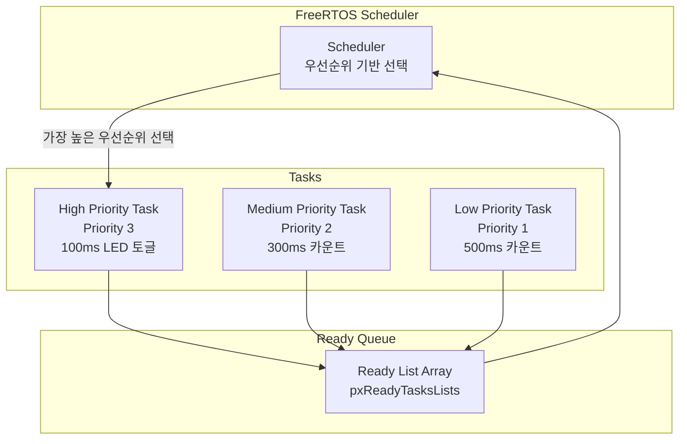
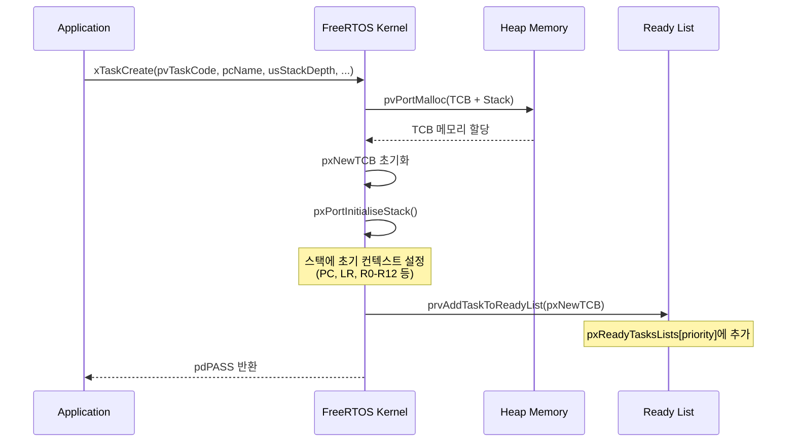
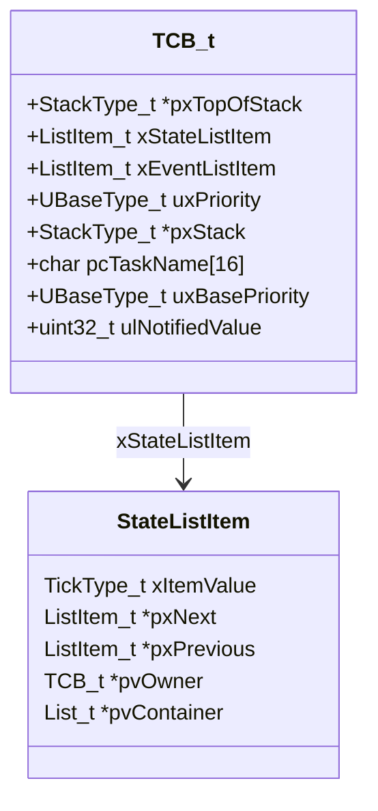
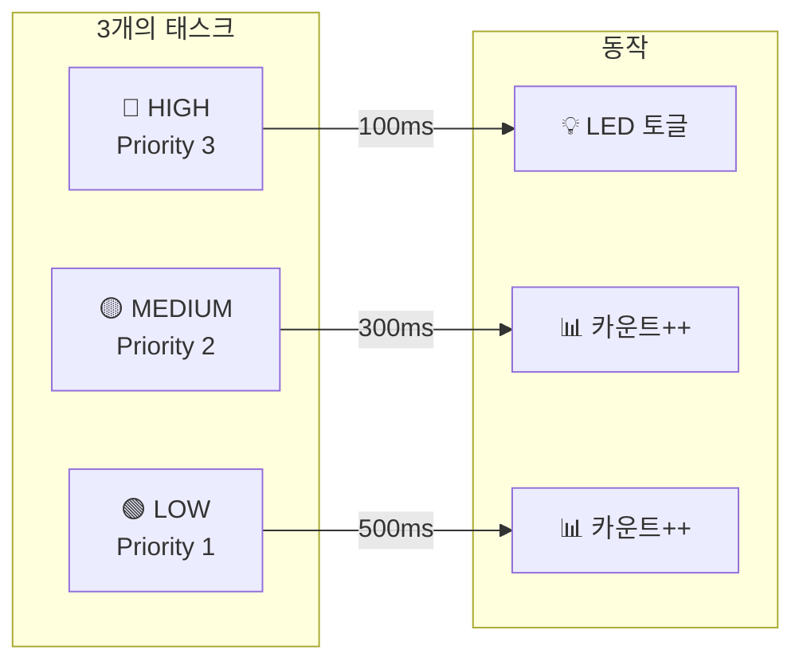
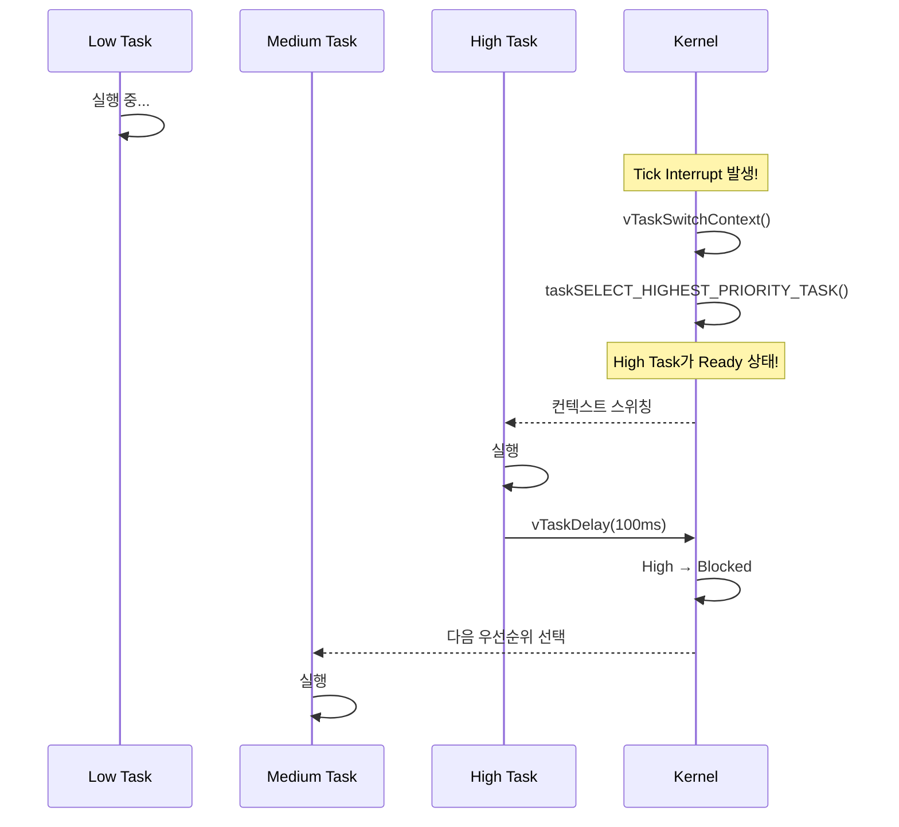

# Example 01: 다중 태스크 우선순위 데모

## 📌 학습 목표

- FreeRTOS 태스크 우선순위 개념 이해
- 선점형(Preemptive) 스케줄링 동작 원리 파악
- `xTaskCreate()` 함수를 사용한 태스크 생성

---

## 🏗️ 시스템 아키텍처



---

## 🔧 사용된 FreeRTOS API

| API | 설명 |
|-----|------|
| `xTaskCreate()` | 새로운 태스크 생성 |
| `vTaskDelay()` | 상대적 시간 딜레이 |
| `vTaskPrioritySet()` | 태스크 우선순위 동적 변경 |
| `uxTaskPriorityGet()` | 현재 우선순위 조회 |

---

## ⚙️ 커널 동작 원리

### xTaskCreate() 내부 동작



### 스케줄러 선택 알고리즘

```c
// tasks.c의 핵심 매크로
#define taskSELECT_HIGHEST_PRIORITY_TASK()                          \
{                                                                    \
    UBaseType_t uxTopPriority = uxTopReadyPriority;                 \
    while(listLIST_IS_EMPTY(&pxReadyTasksLists[uxTopPriority]))     \
    {                                                                \
        --uxTopPriority;                                            \
    }                                                                \
    listGET_OWNER_OF_NEXT_ENTRY(pxCurrentTCB,                       \
                                &pxReadyTasksLists[uxTopPriority]); \
}
```

### TCB (Task Control Block) 구조



---

## 📋 예제 구성



---

## 🔄 선점형 스케줄링 동작

```mermaid
gantt
    title 태스크 실행 타임라인 (1초)
    dateFormat X
    axisFormat %L

    section High (P3)
    실행 :a1, 0, 10
    실행 :a2, 100, 110
    실행 :a3, 200, 210
    실행 :a4, 300, 310

    section Medium (P2)
    실행 :b1, 10, 30
    실행 :b2, 310, 330

    section Low (P1)
    실행 :c1, 30, 50
```



### 선점 발생 시퀀스



---

## 🚀 사용 방법

```c
void core0_main(void)
{
    DAVE_Init();
    
    Ex01_RunDemo();  // 예제 시작
    
    vTaskStartScheduler();
    while(1) { }
}
```

---

## 📊 예상 결과

10초 실행 후 각 태스크 실행 횟수:
- **High Priority**: ~100회 (100ms 주기)
- **Medium Priority**: ~33회 (300ms 주기)
- **Low Priority**: ~20회 (500ms 주기)

---

## 💡 핵심 개념

### 우선순위 레벨
```
configMAX_PRIORITIES = 10 (FreeRTOSConfig.h)

Priority 9 (최고) ─┐
Priority 8        │ 높은 숫자 = 높은 우선순위
Priority 7        │
...               │
Priority 1        │
Priority 0 (Idle) ─┘
```

---

## 🔍 커널 코드 분석

### Ready List 구조 (tasks.c)

```c
// 우선순위별 Ready List 배열
PRIVILEGED_DATA static List_t pxReadyTasksLists[configMAX_PRIORITIES];

// 태스크를 Ready List에 추가
#define prvAddTaskToReadyList(pxTCB)                                    \
    taskRECORD_READY_PRIORITY((pxTCB)->uxPriority);                     \
    listINSERT_END(&pxReadyTasksLists[(pxTCB)->uxPriority],            \
                   &((pxTCB)->xStateListItem))
```

### 컨텍스트 스위칭 (port.c)

```c
// TriCore 포트의 컨텍스트 스위칭
void vTaskSwitchContext(void)
{
    if(uxSchedulerSuspended != (UBaseType_t)0U)
    {
        xYieldPending = pdTRUE;
    }
    else
    {
        xYieldPending = pdFALSE;
        taskSELECT_HIGHEST_PRIORITY_TASK();  // 핵심!
    }
}
```

---

## 🔍 디버깅 팁

1. **FreeRTOS+Trace** 사용: 태스크 스케줄링 시각화
2. **전역 카운터** 확인: `g_ulHighPriorityCount` 등의 값 모니터링
3. **오실로스코프**: LED 핀 측정으로 정확한 타이밍 확인
