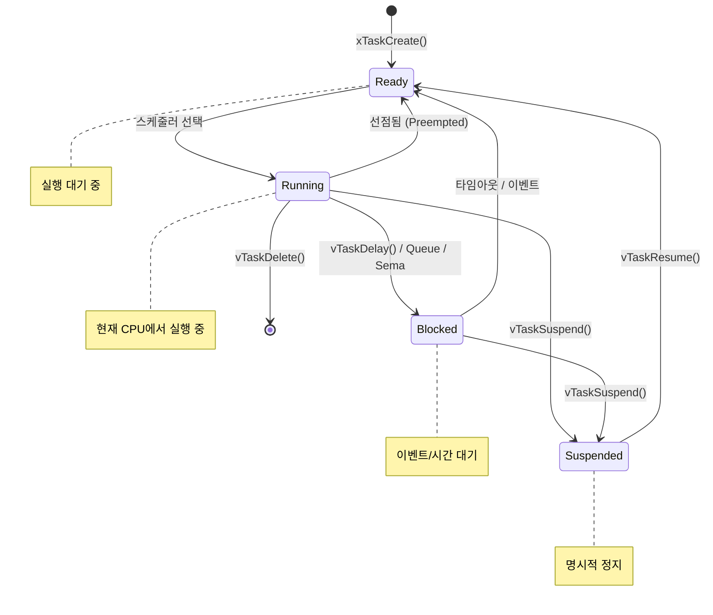
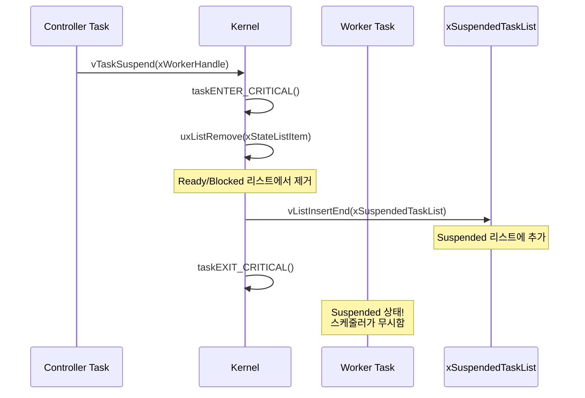
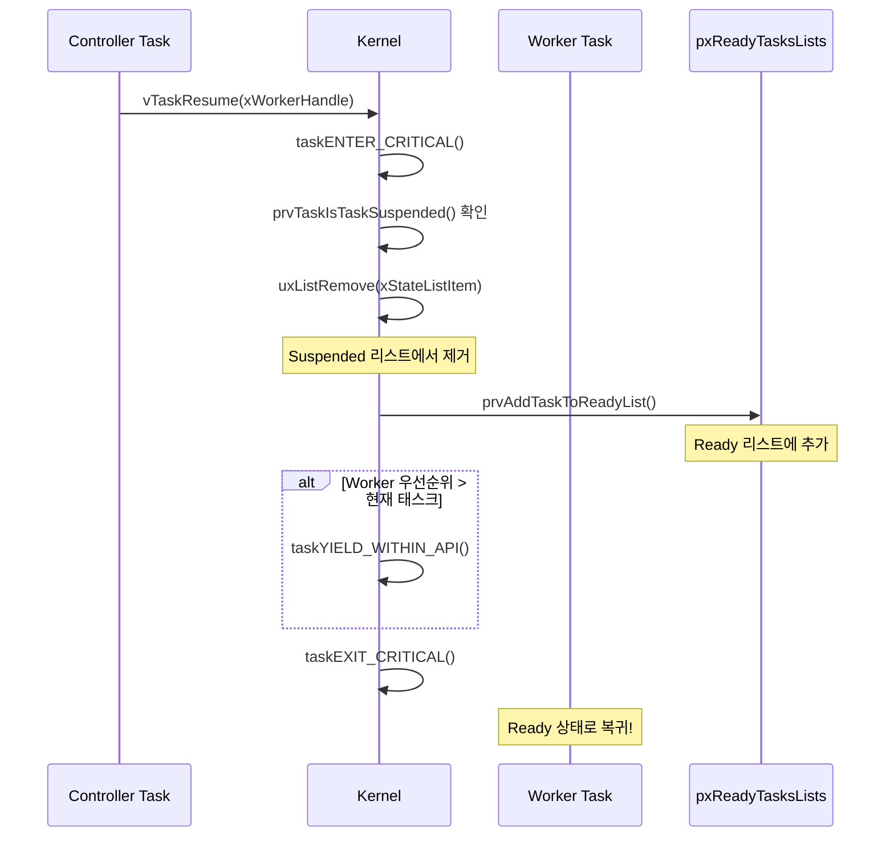
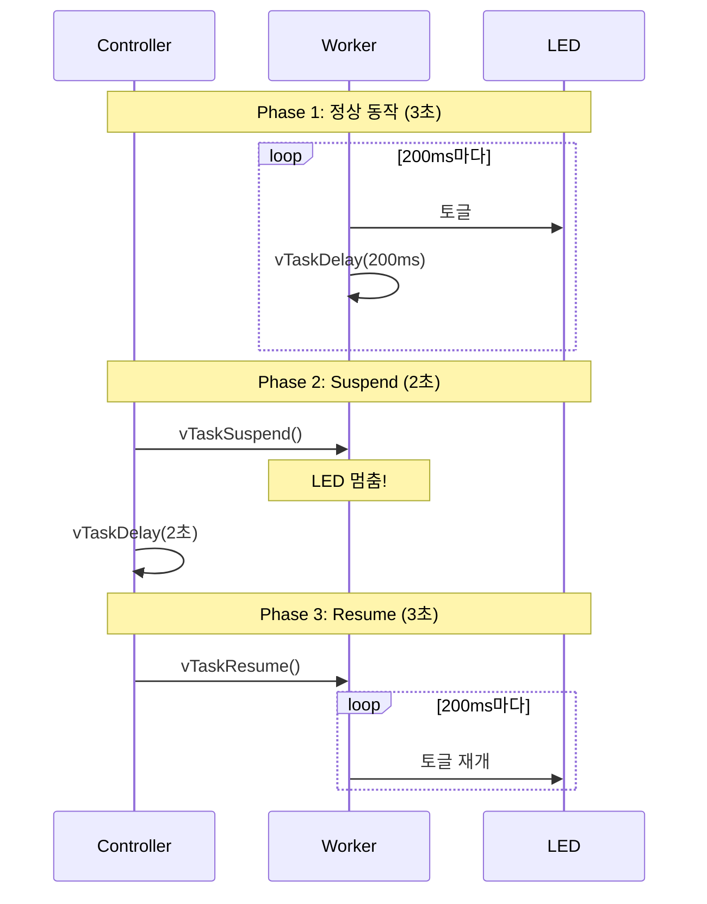
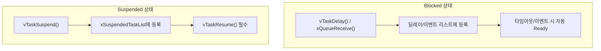
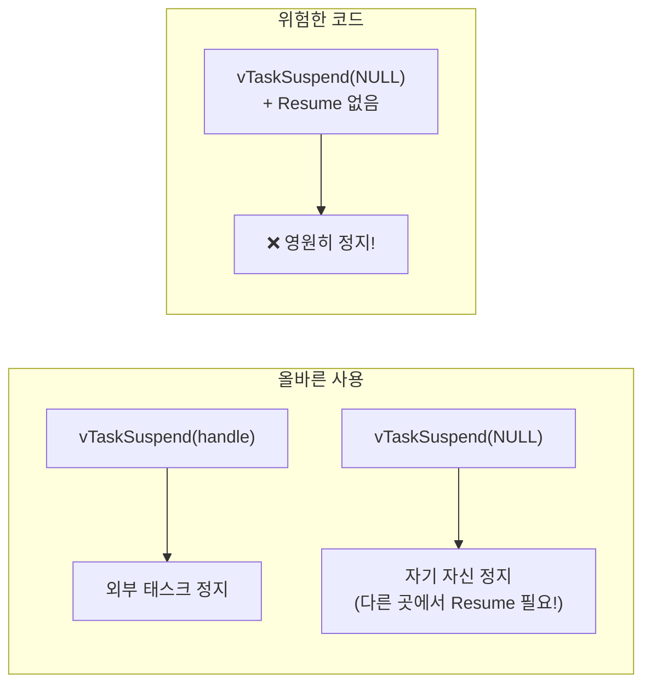

# Example 02: 태스크 상태 관리 데모

## 📌 학습 목표

- FreeRTOS 태스크의 4가지 상태 이해 (Ready, Running, Blocked, Suspended)
- `vTaskSuspend()`, `vTaskResume()` 사용법
- `vTaskDelete()`로 태스크 삭제
- `eTaskGetState()`로 태스크 상태 조회

---

## 🏗️ 태스크 상태 다이어그램



---

## 🔧 사용된 FreeRTOS API

| API | 설명 |
|-----|------|
| `vTaskSuspend()` | 태스크 일시 정지 |
| `vTaskResume()` | 정지된 태스크 재개 |
| `vTaskDelete()` | 태스크 삭제 |
| `eTaskGetState()` | 현재 상태 조회 |
| `xTaskResumeFromISR()` | ISR에서 태스크 재개 |

---

## ⚙️ 커널 동작 원리

### vTaskSuspend() 내부 동작



### vTaskResume() 내부 동작



---

## 📋 예제 시나리오



---

## 🔄 Blocked vs Suspended 차이



| 특성 | Blocked | Suspended |
|------|---------|-----------|
| 원인 | API 호출 (Delay, Queue 등) | vTaskSuspend() |
| 복귀 | 자동 (타임아웃/이벤트) | vTaskResume() 필수 |
| 저장 위치 | Delayed/Event 리스트 | xSuspendedTaskList |

---

## 🔍 커널 코드 분석

### 태스크 상태 열거형 (task.h)

```c
typedef enum
{
    eRunning = 0,   // 현재 실행 중
    eReady,         // 실행 대기
    eBlocked,       // 이벤트/시간 대기
    eSuspended,     // 명시적 정지
    eDeleted        // 삭제됨 (메모리 해제 대기)
} eTaskState;
```

### vTaskSuspend() 구현 (tasks.c)

```c
void vTaskSuspend(TaskHandle_t xTaskToSuspend)
{
    TCB_t *pxTCB;
    
    taskENTER_CRITICAL();
    {
        pxTCB = prvGetTCBFromHandle(xTaskToSuspend);
        
        // 현재 리스트에서 제거
        if(uxListRemove(&(pxTCB->xStateListItem)) == 0)
        {
            taskRESET_READY_PRIORITY(pxTCB->uxPriority);
        }
        
        // Event 리스트에서도 제거 (있다면)
        if(listLIST_ITEM_CONTAINER(&(pxTCB->xEventListItem)) != NULL)
        {
            uxListRemove(&(pxTCB->xEventListItem));
        }
        
        // Suspended 리스트에 추가
        vListInsertEnd(&xSuspendedTaskList, &(pxTCB->xStateListItem));
    }
    taskEXIT_CRITICAL();
    
    // 자기 자신을 Suspend 했다면 스케줄링
    if(pxTCB == pxCurrentTCB)
    {
        portYIELD_WITHIN_API();
    }
}
```

---

## 🚀 사용 방법

```c
void core0_main(void)
{
    DAVE_Init();
    
    Ex02_RunDemo();  // 예제 시작
    
    vTaskStartScheduler();
    while(1) { }
}
```

---

## ⚠️ 주의사항



---

## 💡 핵심 정리

1. **Suspend**는 명시적 정지 - Resume 없이는 절대 깨어나지 않음
2. **Blocked**는 조건부 정지 - 조건 충족 시 자동 Ready
3. **Delete**된 태스크의 메모리는 Idle 태스크가 정리
4. ISR에서는 `xTaskResumeFromISR()` 사용 필수
