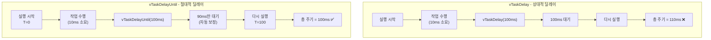
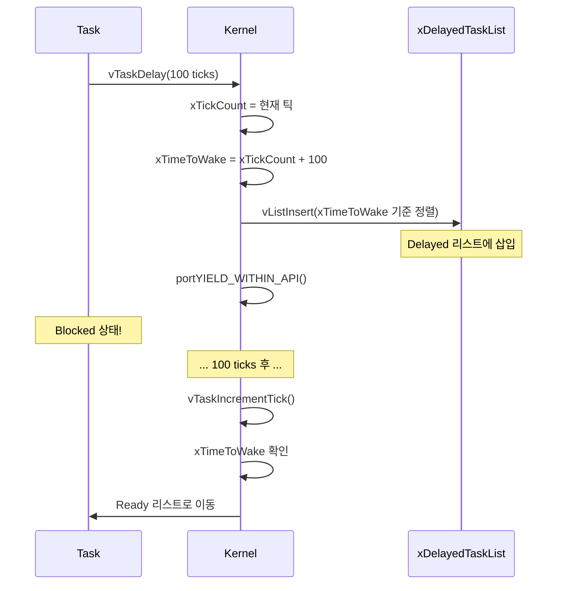
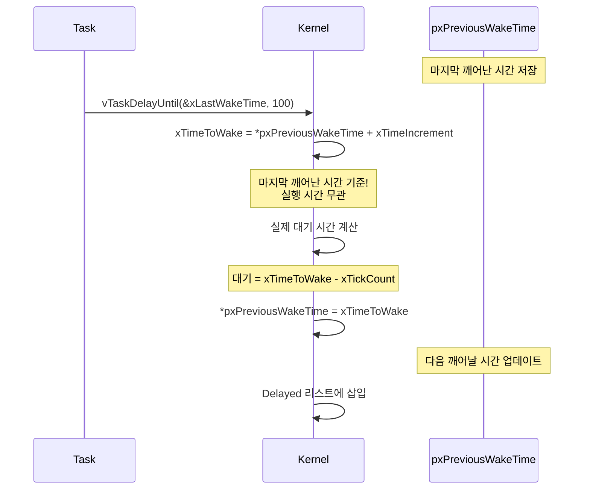
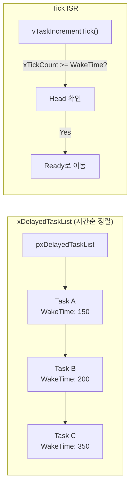
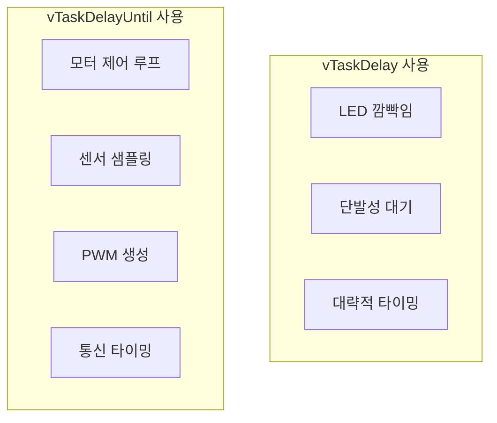

# Example 03: 주기적 태스크 실행 데모

## 📌 학습 목표

- `vTaskDelay()`와 `vTaskDelayUntil()` 차이점 이해
- 정밀한 주기적 태스크 구현 방법
- `xTaskGetTickCount()`로 시간 측정

---

## 🔄 vTaskDelay vs vTaskDelayUntil



---

## 📊 타이밍 비교

```mermaid
gantt
    title 주기 비교 (목표: 100ms)
    dateFormat X
    axisFormat %L
    
    section vTaskDelay
    작업(10ms)     :a1, 0, 10
    대기(100ms)    :a2, 10, 110
    작업(15ms)     :a3, 110, 125
    대기(100ms)    :a4, 125, 225
    
    section vTaskDelayUntil
    작업(10ms)     :b1, 0, 10
    대기(90ms)     :b2, 10, 100
    작업(15ms)     :b3, 100, 115
    대기(85ms)     :b4, 115, 200
```



---

## ⚙️ 커널 동작 원리

### vTaskDelay() 내부 동작



### vTaskDelayUntil() 핵심 로직



---

## 🔍 커널 코드 분석

### vTaskDelay() 구현 (tasks.c)

```c
void vTaskDelay(const TickType_t xTicksToDelay)
{
    TickType_t xTimeToWake;
    
    if(xTicksToDelay > 0)
    {
        taskENTER_CRITICAL();
        {
            // 현재 시간 + 딜레이 = 깨어날 시간
            xTimeToWake = xTickCount + xTicksToDelay;
            
            // Ready 리스트에서 제거
            uxListRemove(&(pxCurrentTCB->xStateListItem));
            
            // Delayed 리스트에 삽입
            prvAddCurrentTaskToDelayedList(xTimeToWake, pdFALSE);
        }
        taskEXIT_CRITICAL();
        
        portYIELD_WITHIN_API();
    }
}
```

### vTaskDelayUntil() 구현 (tasks.c)

```c
BaseType_t xTaskDelayUntil(TickType_t *pxPreviousWakeTime,
                           const TickType_t xTimeIncrement)
{
    TickType_t xTimeToWake;
    BaseType_t xShouldDelay = pdFALSE;
    
    taskENTER_CRITICAL();
    {
        const TickType_t xConstTickCount = xTickCount;
        
        // 핵심: 마지막 깨어난 시간 + 주기
        xTimeToWake = *pxPreviousWakeTime + xTimeIncrement;
        
        // 아직 깨어날 시간이 안됐으면 대기
        if(xConstTickCount < xTimeToWake)
        {
            prvAddCurrentTaskToDelayedList(xTimeToWake, pdFALSE);
            xShouldDelay = pdTRUE;
        }
        
        // 다음 깨어날 시간 업데이트
        *pxPreviousWakeTime = xTimeToWake;
    }
    taskEXIT_CRITICAL();
    
    if(xShouldDelay)
    {
        portYIELD_WITHIN_API();
    }
    
    return xShouldDelay;
}
```

---

## 📋 Delayed Task List 구조



---

## 🚀 사용 방법

```c
// 정확한 100ms 주기 태스크
void vPeriodicTask(void *pvParameters)
{
    TickType_t xLastWakeTime = xTaskGetTickCount();  // 초기화 필수!
    
    for(;;)
    {
        // 작업 수행
        doWork();
        
        // 정확한 100ms 주기 보장
        vTaskDelayUntil(&xLastWakeTime, pdMS_TO_TICKS(100));
    }
}
```

---

## 📊 적용 시나리오



---

## ⚠️ 주의사항

> [!CAUTION]
> `vTaskDelayUntil()` 사용 시 `xLastWakeTime`을 **반드시 초기화**해야 합니다!

```c
// ❌ 잘못된 코드
void vTask(void)
{
    TickType_t xLastWakeTime;  // 초기화 안됨!
    vTaskDelayUntil(&xLastWakeTime, 100);  // 문제 발생
}

// ✅ 올바른 코드
void vTask(void)
{
    TickType_t xLastWakeTime = xTaskGetTickCount();  // 초기화!
    vTaskDelayUntil(&xLastWakeTime, 100);
}
```

---

## 💡 핵심 정리

| 항목 | vTaskDelay | vTaskDelayUntil |
|------|------------|-----------------|
| 기준점 | 호출 시점 | 마지막 깨어난 시점 |
| 실행시간 영향 | 있음 (주기 늘어남) | 없음 (보정됨) |
| 주기 정확도 | 흔들림 | 정확함 |
| 초기화 | 불필요 | xLastWakeTime 필수 |
| 용도 | 대략적 대기 | 정밀 주기 태스크 |
