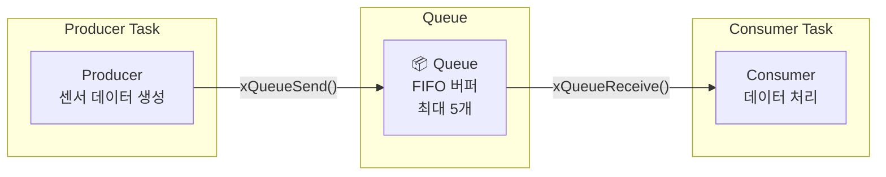
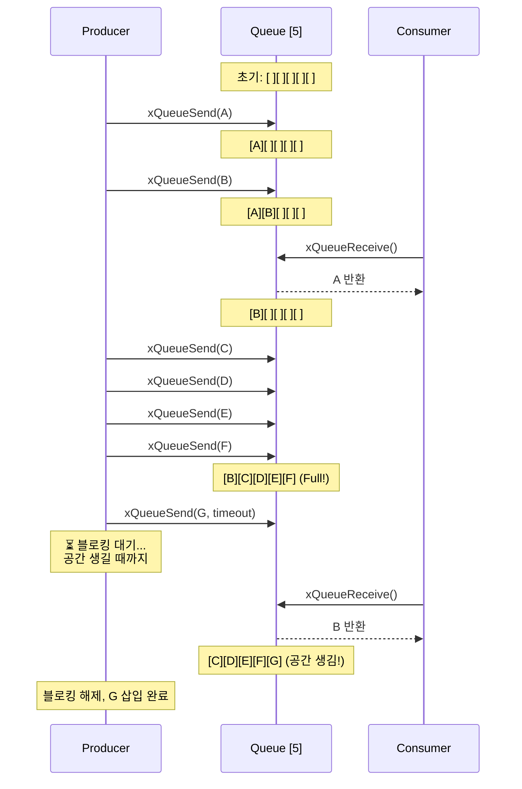
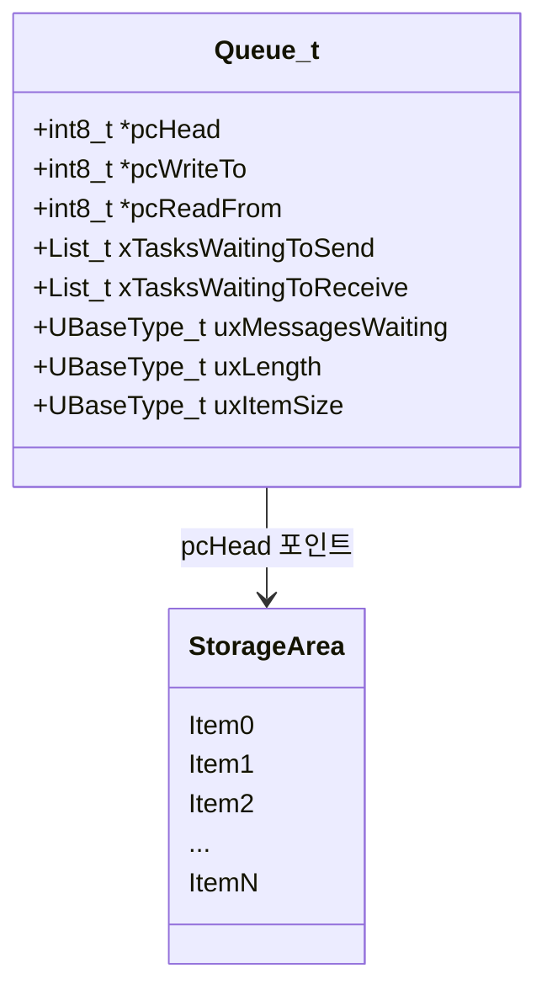
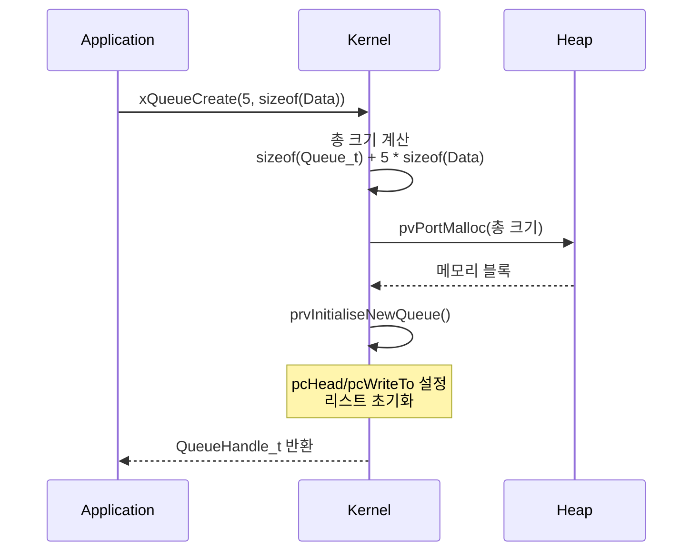
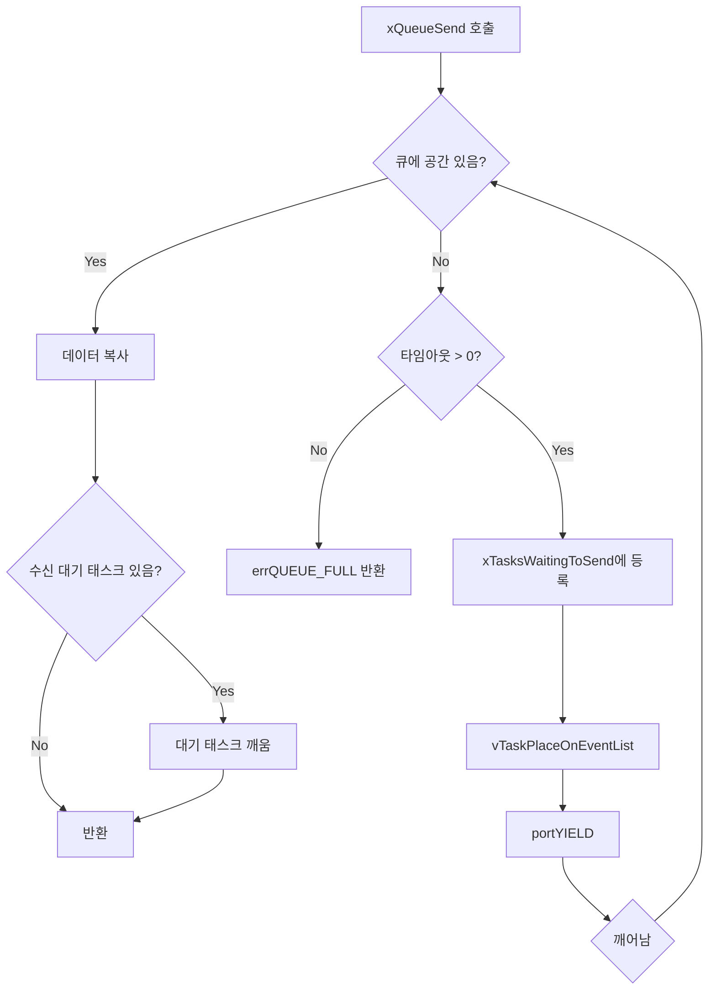
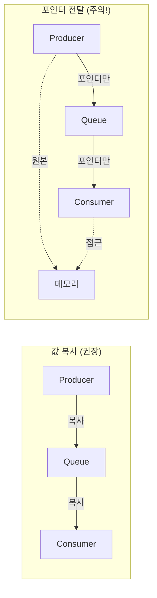

# Example 04: Queue 통신 데모 (Producer/Consumer)

## 📌 학습 목표

- FreeRTOS Queue를 사용한 태스크 간 데이터 통신
- Producer-Consumer 패턴 이해
- Queue 블로킹 메커니즘 파악

---

## 🏗️ 시스템 아키텍처



---

## 🔄 Queue 동작 원리



---

## 📦 Queue 내부 구조



```
Queue 메모리 레이아웃:
┌──────────────────────────────────────────────────┐
│ Queue_t 구조체 │ Item[0] │ Item[1] │ ... │ Item[N] │
└──────────────────────────────────────────────────┘
                  ↑         ↑
              pcHead    pcWriteTo
```

---

## ⚙️ 커널 동작 원리

### xQueueCreate() 내부 동작



### xQueueSend() 블로킹 로직



---

## 🔍 커널 코드 분석

### Queue 생성 (queue.c)

```c
QueueHandle_t xQueueGenericCreate(const UBaseType_t uxQueueLength,
                                   const UBaseType_t uxItemSize,
                                   const uint8_t ucQueueType)
{
    Queue_t *pxNewQueue;
    size_t xQueueSizeInBytes;
    
    // 메모리 크기 계산
    xQueueSizeInBytes = sizeof(Queue_t) + (uxQueueLength * uxItemSize);
    
    pxNewQueue = pvPortMalloc(xQueueSizeInBytes);
    
    if(pxNewQueue != NULL)
    {
        // 스토리지 영역은 Queue_t 바로 뒤
        pxNewQueue->pcHead = ((int8_t*)pxNewQueue) + sizeof(Queue_t);
        
        // 초기화
        prvInitialiseNewQueue(uxQueueLength, uxItemSize, 
                              pxNewQueue->pcHead, ucQueueType, pxNewQueue);
    }
    
    return pxNewQueue;
}
```

### xQueueSend() 핵심 로직 (queue.c)

```c
BaseType_t xQueueGenericSend(QueueHandle_t xQueue,
                             const void *pvItemToQueue,
                             TickType_t xTicksToWait,
                             const BaseType_t xCopyPosition)
{
    Queue_t *pxQueue = xQueue;
    
    for(;;)
    {
        taskENTER_CRITICAL();
        {
            // 공간이 있는지 확인
            if(pxQueue->uxMessagesWaiting < pxQueue->uxLength)
            {
                // 데이터 복사
                prvCopyDataToQueue(pxQueue, pvItemToQueue, xCopyPosition);
                
                // 수신 대기 중인 태스크가 있으면 깨움
                if(!listLIST_IS_EMPTY(&(pxQueue->xTasksWaitingToReceive)))
                {
                    xTaskRemoveFromEventList(&(pxQueue->xTasksWaitingToReceive));
                }
                
                taskEXIT_CRITICAL();
                return pdPASS;
            }
            else
            {
                // 공간 없음 - 대기 필요
                if(xTicksToWait == 0)
                {
                    taskEXIT_CRITICAL();
                    return errQUEUE_FULL;
                }
                
                // 대기 리스트에 등록
                vTaskPlaceOnEventList(&(pxQueue->xTasksWaitingToSend), 
                                      xTicksToWait);
            }
        }
        taskEXIT_CRITICAL();
        
        portYIELD_WITHIN_API();  // 블로킹
    }
}
```

---

## 📋 API 요약

| API | 설명 | 블로킹 |
|-----|------|--------|
| `xQueueCreate()` | 큐 생성 | - |
| `xQueueSend()` | 뒤에 삽입 | ✅ |
| `xQueueSendToFront()` | 앞에 삽입 | ✅ |
| `xQueueReceive()` | 앞에서 제거 | ✅ |
| `xQueuePeek()` | 앞 확인 (제거 안함) | ✅ |
| `uxQueueMessagesWaiting()` | 대기 메시지 수 | ❌ |
| `uxQueueSpacesAvailable()` | 남은 공간 수 | ❌ |

---

## 🔄 값 복사 vs 포인터 전달



> [!WARNING]
> 포인터 전달 시 원본 메모리 수명 관리 필수!

---

## 🚀 사용 방법

```c
// 큐 생성
QueueHandle_t xQueue = xQueueCreate(5, sizeof(SensorData_t));

// Producer
xQueueSend(xQueue, &data, portMAX_DELAY);

// Consumer
xQueueReceive(xQueue, &receivedData, portMAX_DELAY);
```

---

## 💡 핵심 정리

1. **FIFO 버퍼**: 먼저 넣은 데이터가 먼저 나옴
2. **값 복사**: 데이터를 큐 내부로 복사 (안전)
3. **블로킹 지원**: 가득 참/비어있음 시 자동 대기
4. **ISR 안전**: FromISR 버전 API 사용
