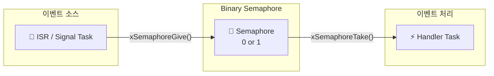
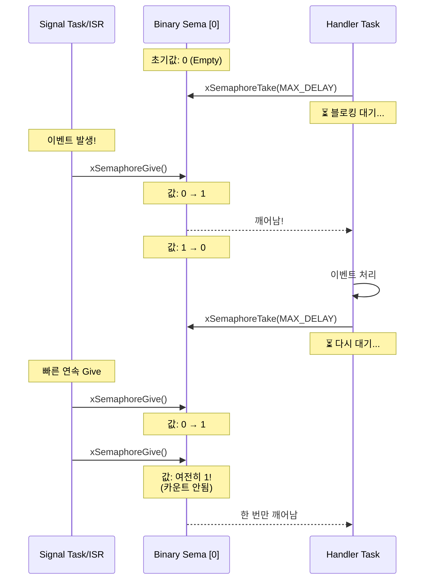
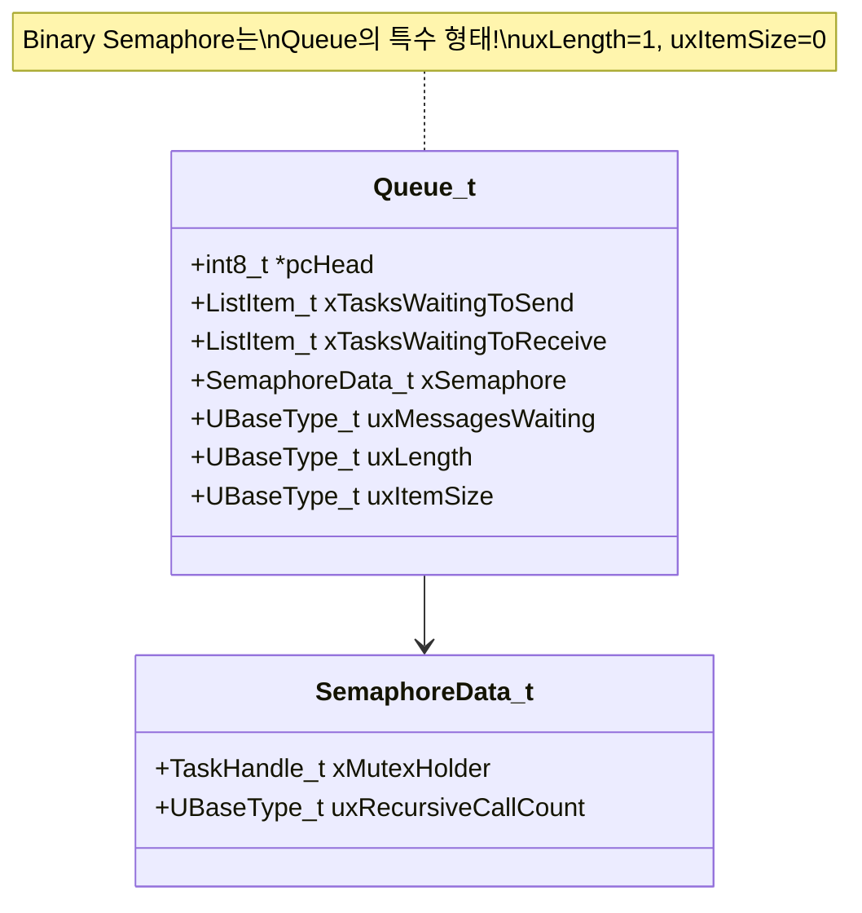
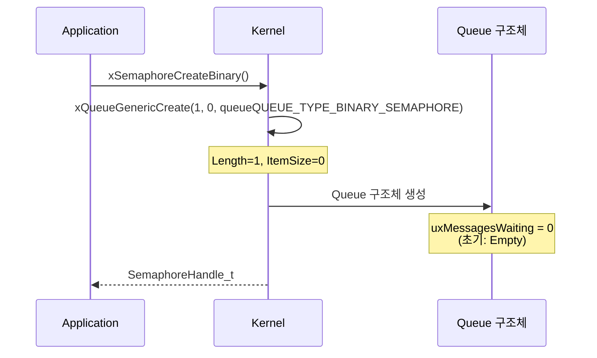
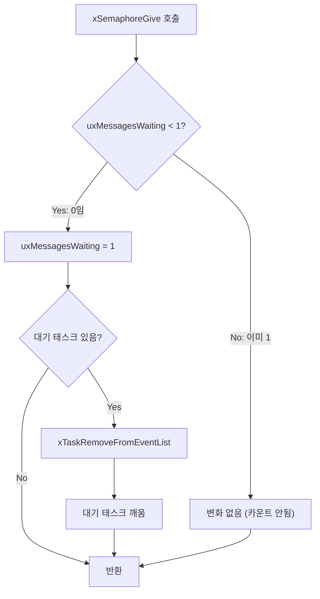
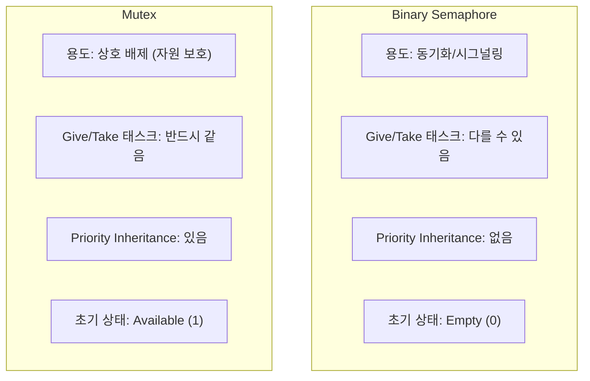
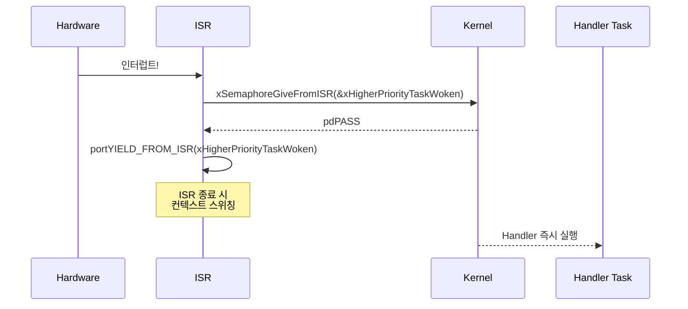

# Example 05: Binary Semaphore 데모

## 📌 학습 목표

- Binary Semaphore를 이용한 이벤트 동기화
- ISR-Task 동기화 패턴 이해
- Semaphore와 Mutex의 차이점

---

## 🏗️ 동기화 패턴



---

## 🔄 Binary Semaphore 동작



---

## 📦 Semaphore 내부 구조



---

## ⚙️ 커널 동작 원리

### xSemaphoreCreateBinary() 내부



### xSemaphoreGive() 로직



---

## 🔍 커널 코드 분석

### Binary Semaphore 생성 (semphr.h)

```c
#define xSemaphoreCreateBinary()                                    \
    xQueueGenericCreate(1, semSEMAPHORE_QUEUE_ITEM_LENGTH,         \
                        queueQUEUE_TYPE_BINARY_SEMAPHORE)

// semSEMAPHORE_QUEUE_ITEM_LENGTH = 0
// → 실제 데이터 저장 없음, 카운트만 사용
```

### xSemaphoreGive() 구현 (semphr.h → queue.c)

```c
#define xSemaphoreGive(xSemaphore)  \
    xQueueGenericSend((xSemaphore), NULL, 0, queueSEND_TO_BACK)

// Binary Semaphore에서:
// - NULL 데이터 전송 (ItemSize=0이므로)
// - uxMessagesWaiting가 1 이하일 때만 성공
// - 이미 1이면 변화 없음 (Full 상태)
```

### xSemaphoreTake() 구현

```c
#define xSemaphoreTake(xSemaphore, xBlockTime)  \
    xQueueSemaphoreTake((xSemaphore), (xBlockTime))

// 내부 동작:
// - uxMessagesWaiting > 0 이면 1 감소하고 반환
// - uxMessagesWaiting == 0 이면 블로킹 대기
```

---

## 🆚 Binary Semaphore vs Mutex



---

## 🔔 ISR에서 사용



### ISR 코드 예시

```c
void vExternalInterruptHandler(void)
{
    BaseType_t xHigherPriorityTaskWoken = pdFALSE;
    
    // ISR에서는 FromISR 버전 사용!
    xSemaphoreGiveFromISR(xBinarySema, &xHigherPriorityTaskWoken);
    
    // 컨텍스트 스위칭 요청
    portYIELD_FROM_ISR(xHigherPriorityTaskWoken);
}
```

---

## 📋 API 요약

| API | 컨텍스트 | 설명 |
|-----|----------|------|
| `xSemaphoreCreateBinary()` | Task | Binary Sema 생성 |
| `xSemaphoreGive()` | Task | 시그널 발생 |
| `xSemaphoreTake()` | Task | 시그널 대기 |
| `xSemaphoreGiveFromISR()` | **ISR** | ISR용 Give |
| `xSemaphoreTakeFromISR()` | **ISR** | ISR용 Take |

---

## 💡 핵심 정리

1. **Binary**: 값이 0 또는 1만 가능
2. **동기화 용도**: ISR → Task 시그널 전달
3. **초기 Empty**: 생성 직후 Take하면 블로킹
4. **카운트 안됨**: 연속 Give해도 하나만 기록
