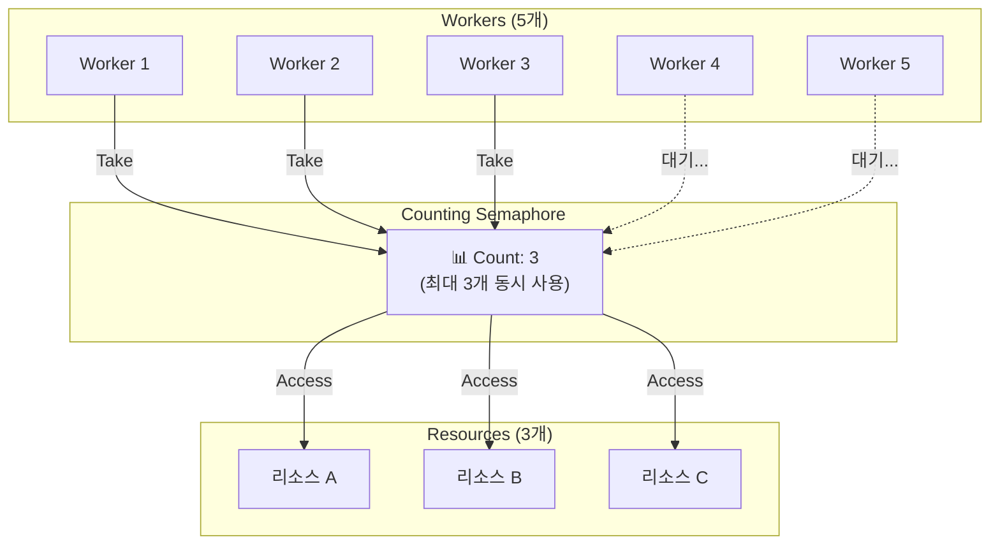
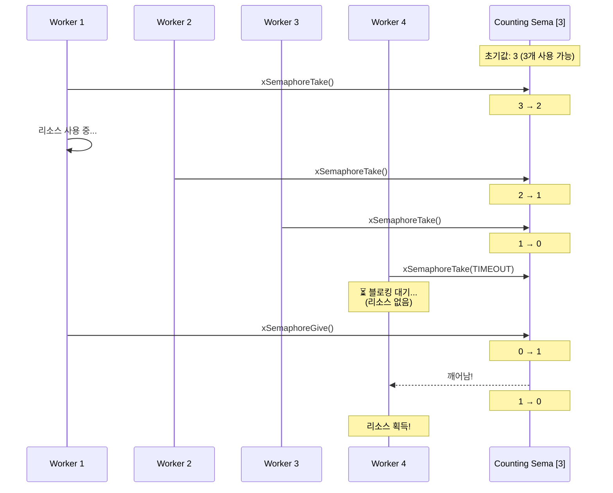
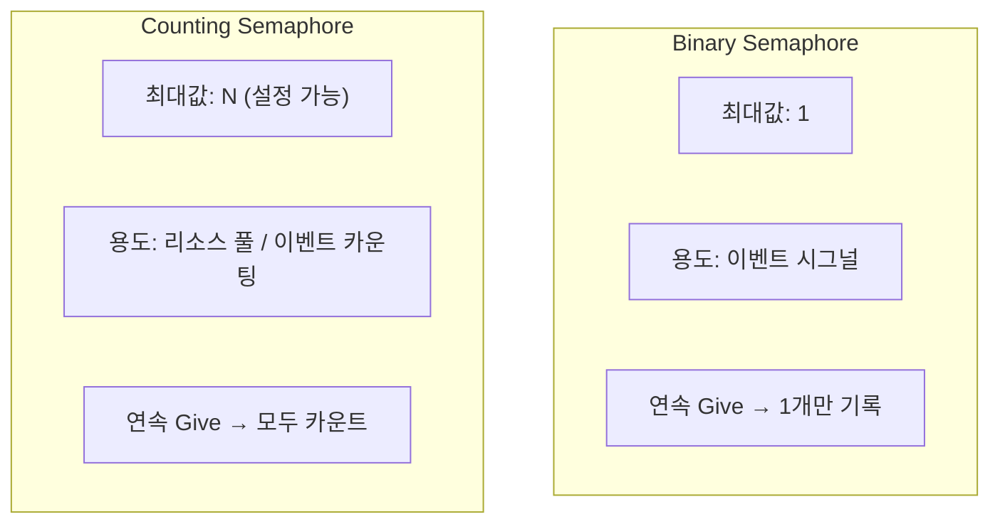
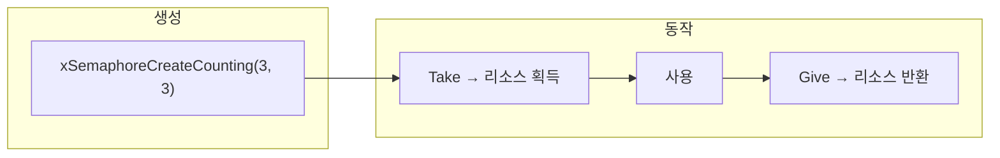
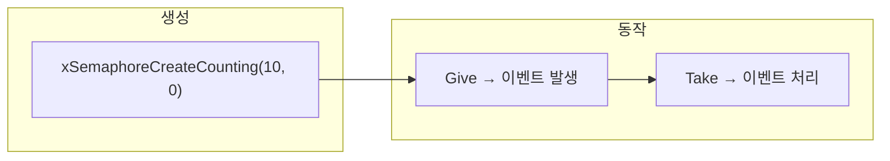
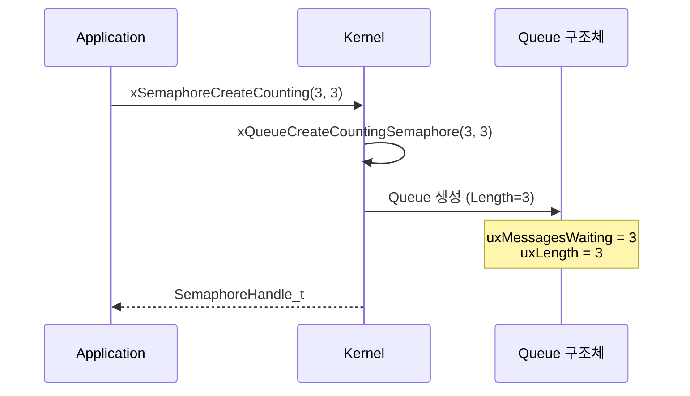
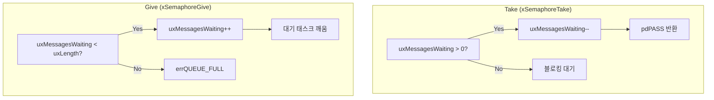

# Example 06: Counting Semaphore 데모

## 📌 학습 목표

- Counting Semaphore로 리소스 풀 관리
- Binary vs Counting Semaphore 차이
- 이벤트 카운팅 패턴 이해

---

## 🏗️ 리소스 풀 패턴



---

## 🔄 Counting Semaphore 동작



---

## 🆚 Binary vs Counting



| 특성 | Binary | Counting |
|------|--------|----------|
| 최대 값 | 1 | N (설정) |
| 연속 Give | 1개만 기록 | 모두 카운트 |
| 주요 용도 | 이벤트 시그널 | 리소스 풀, 카운팅 |

---

## 📊 두 가지 사용 패턴

### 패턴 1: 리소스 풀



- **최대값 = 초기값**: 모든 리소스 사용 가능
- Take = 리소스 획득, Give = 리소스 반환

### 패턴 2: 이벤트 카운팅



- **초기값 = 0**: 이벤트 없음
- Give = 이벤트 발생, Take = 이벤트 처리

---

## ⚙️ 커널 동작 원리

### 생성 시 내부 구조



### Take/Give 카운트 변화



---

## 🔍 커널 코드 분석

### Counting Semaphore 생성 (semphr.h → queue.c)

```c
#define xSemaphoreCreateCounting(uxMaxCount, uxInitialCount)       \
    xQueueCreateCountingSemaphore((uxMaxCount), (uxInitialCount))

QueueHandle_t xQueueCreateCountingSemaphore(
    const UBaseType_t uxMaxCount,
    const UBaseType_t uxInitialCount)
{
    QueueHandle_t xHandle;
    
    // Queue 생성 (ItemSize = 0)
    xHandle = xQueueGenericCreate(uxMaxCount, 
                                   0,  // 데이터 없음
                                   queueQUEUE_TYPE_COUNTING_SEMAPHORE);
    
    if(xHandle != NULL)
    {
        // 초기 카운트 설정
        ((Queue_t*)xHandle)->uxMessagesWaiting = uxInitialCount;
    }
    
    return xHandle;
}
```

### 카운트 조회 (semphr.h)

```c
#define uxSemaphoreGetCount(xSemaphore)     \
    uxQueueMessagesWaiting((QueueHandle_t)(xSemaphore))

// 현재 사용 가능한 리소스 수 반환
// 리소스 풀: 초기값 - 사용 중인 수
// 이벤트 카운팅: 아직 처리 안된 이벤트 수
```

---

## 📋 예제 시나리오

```mermaid
gantt
    title 5개 Worker가 3개 리소스 경쟁
    dateFormat X
    axisFormat %L

    section Worker 1
    리소스 사용     :w1, 0, 500
    
    section Worker 2
    리소스 사용     :w2, 100, 600
    
    section Worker 3
    리소스 사용     :w3, 200, 700
    
    section Worker 4
    대기            :crit, wait4, 300, 500
    리소스 사용     :w4, 500, 1000
    
    section Worker 5
    대기            :crit, wait5, 400, 600
    리소스 사용     :w5, 600, 1100
```



---

## 🚀 사용 방법

```c
// 리소스 풀 생성 (최대 3개, 초기 3개 사용 가능)
SemaphoreHandle_t xResourcePool = 
    xSemaphoreCreateCounting(3, 3);

// Worker 태스크
void vWorkerTask(void *pvParameters)
{
    for(;;)
    {
        // 리소스 획득 (없으면 대기)
        if(xSemaphoreTake(xResourcePool, portMAX_DELAY) == pdPASS)
        {
            // 리소스 사용
            useResource();
            
            // 리소스 반환 (필수!)
            xSemaphoreGive(xResourcePool);
        }
    }
}
```

---

## ⚠️ 주의사항

> [!CAUTION]
> Take 후 반드시 Give! 그렇지 않으면 리소스 누수 발생

```c
// ❌ 잘못된 코드 - 예외 시 Give 안됨
xSemaphoreTake(xPool, MAX_DELAY);
result = doWork();  // 여기서 에러 발생하면?
xSemaphoreGive(xPool);  // 실행 안됨!

// ✅ 올바른 코드 - 항상 Give
xSemaphoreTake(xPool, MAX_DELAY);
result = doWork();
xSemaphoreGive(xPool);  // 에러와 관계없이 항상 실행
```

---

## 💡 핵심 정리

1. **카운팅 가능**: 0 ~ 최대값까지 카운트
2. **리소스 풀**: 초기값 = 최대값으로 생성
3. **이벤트 카운팅**: 초기값 = 0으로 생성
4. **반환 필수**: Take 후 Give 누락 주의
