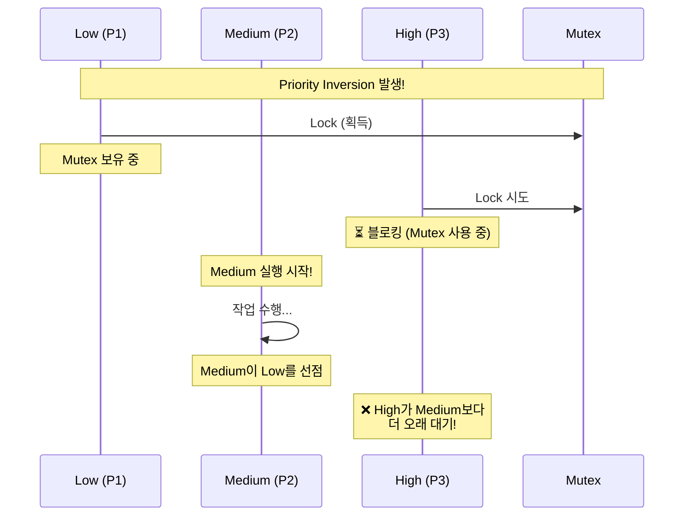
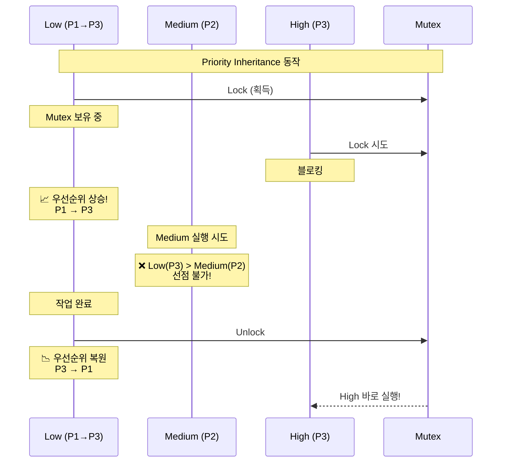
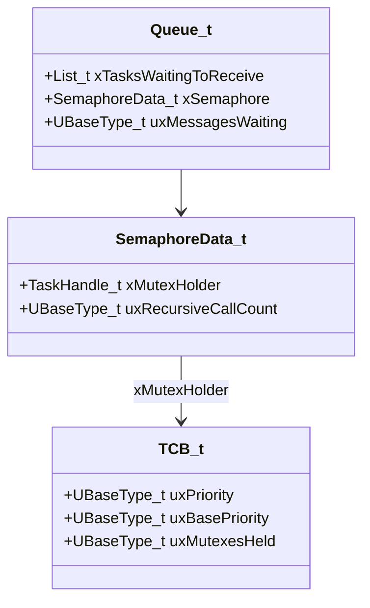
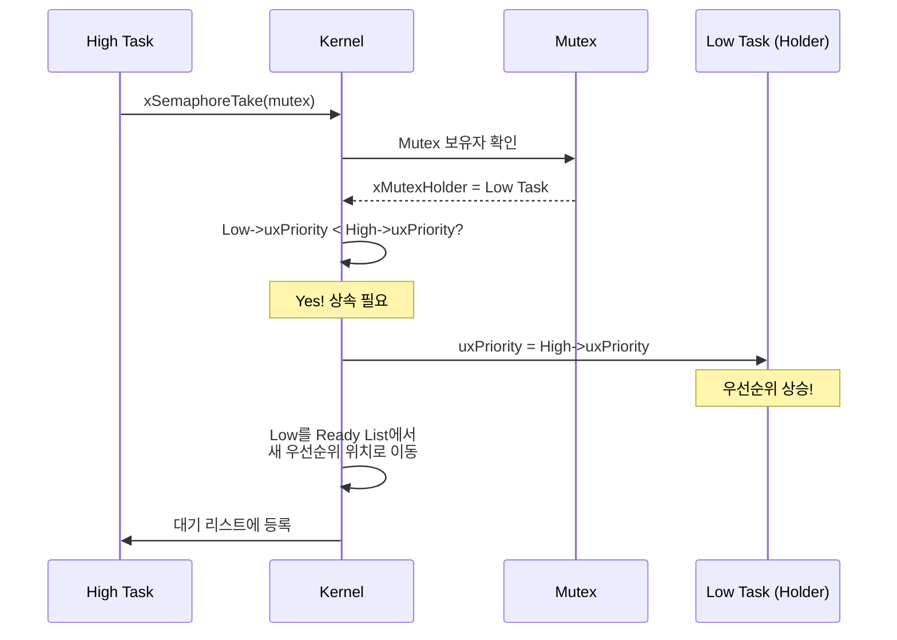
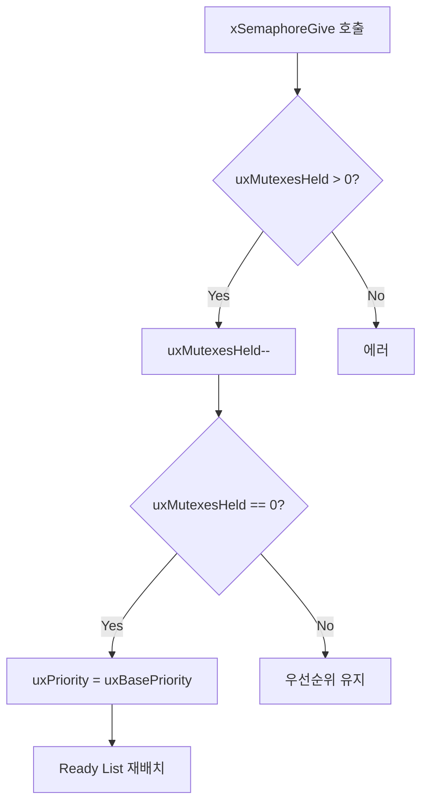
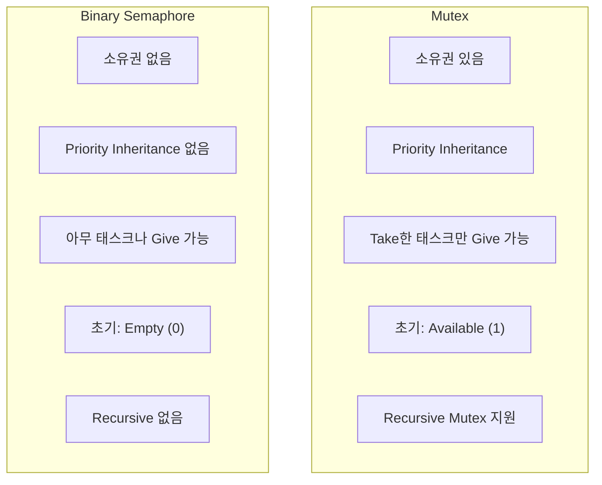
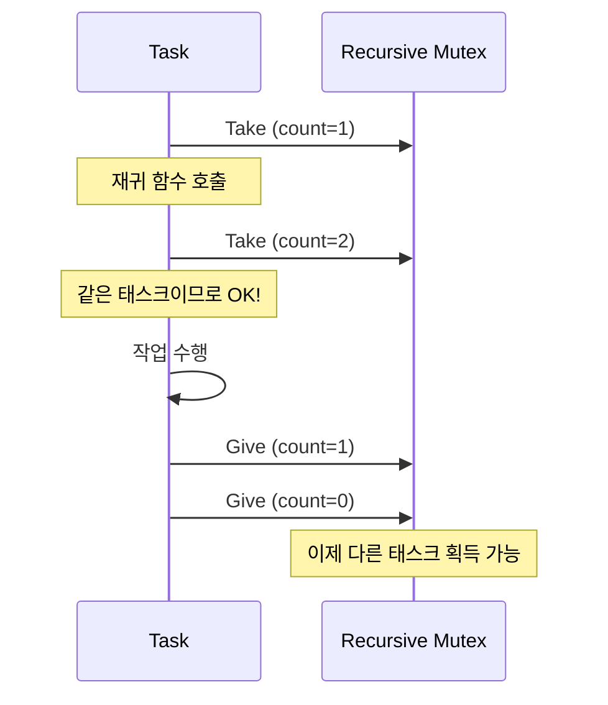
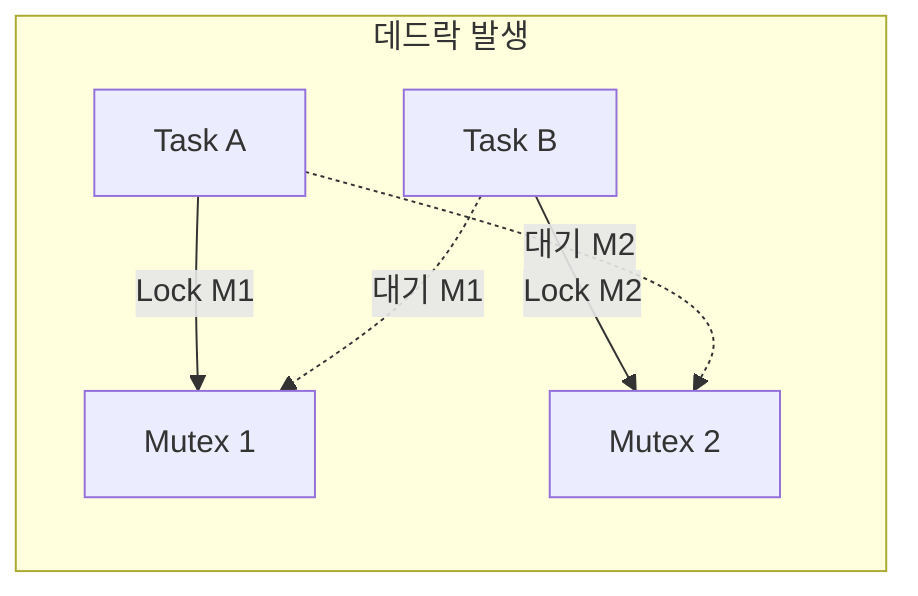

# Example 07: Mutex 데모 (Priority Inheritance)

## 📌 학습 목표

- Mutex로 공유 자원 보호
- Priority Inheritance 메커니즘 이해
- Mutex와 Binary Semaphore 차이점

---

## ⚠️ Priority Inversion 문제



---

## ✅ Priority Inheritance 해결책



---

## 🔄 Priority Inheritance 타임라인

```mermaid
gantt
    title Priority Inheritance 동작
    dateFormat X
    axisFormat %L
    
    section Without Inheritance
    Low 실행     :l1, 0, 10
    Medium 선점  :crit, m1, 10, 50
    Low 재개     :l2, 50, 60
    High 실행    :h1, 60, 70
    
    section With Inheritance
    Low 실행     :l3, 0, 20
    High 실행    :h2, 20, 30
    Medium 실행  :m2, 30, 50
```



---

## 📦 Mutex 내부 구조



---

## ⚙️ 커널 동작 원리

### Priority Inheritance 구현



### xSemaphoreGive() 우선순위 복원



---

## 🔍 커널 코드 분석

### Mutex 생성 (semphr.h → queue.c)

```c
#define xSemaphoreCreateMutex() \
    xQueueCreateMutex(queueQUEUE_TYPE_MUTEX)

QueueHandle_t xQueueCreateMutex(const uint8_t ucQueueType)
{
    QueueHandle_t xNewQueue;
    
    xNewQueue = xQueueGenericCreate(1, 0, ucQueueType);
    
    if(xNewQueue != NULL)
    {
        // Mutex는 초기 상태가 Available (1)
        ((Queue_t*)xNewQueue)->uxMessagesWaiting = 1;
        
        // 소유자 없음
        ((Queue_t*)xNewQueue)->u.xSemaphore.xMutexHolder = NULL;
    }
    
    return xNewQueue;
}
```

### Priority Inheritance 로직 (tasks.c)

```c
BaseType_t xTaskPriorityInherit(TaskHandle_t const pxMutexHolder)
{
    TCB_t *pxMutexHolderTCB = pxMutexHolder;
    
    if(pxMutexHolderTCB->uxPriority < pxCurrentTCB->uxPriority)
    {
        // Ready List에서 제거
        uxListRemove(&(pxMutexHolderTCB->xStateListItem));
        
        // 우선순위 상승
        pxMutexHolderTCB->uxPriority = pxCurrentTCB->uxPriority;
        
        // 새 우선순위의 Ready List에 추가
        prvAddTaskToReadyList(pxMutexHolderTCB);
        
        return pdTRUE;
    }
    
    return pdFALSE;
}
```

### Priority Disinherit (락 해제 시)

```c
BaseType_t xTaskPriorityDisinherit(TaskHandle_t const pxMutexHolder)
{
    TCB_t *pxTCB = pxMutexHolder;
    
    pxTCB->uxMutexesHeld--;
    
    if(pxTCB->uxPriority != pxTCB->uxBasePriority)
    {
        if(pxTCB->uxMutexesHeld == 0)
        {
            // 원래 우선순위로 복원
            uxListRemove(&(pxTCB->xStateListItem));
            pxTCB->uxPriority = pxTCB->uxBasePriority;
            prvAddTaskToReadyList(pxTCB);
            
            return pdTRUE;
        }
    }
    
    return pdFALSE;
}
```

---

## 🆚 Mutex vs Binary Semaphore



---

## 🔄 Recursive Mutex



---

## 🚀 사용 방법

```c
// Mutex 생성
SemaphoreHandle_t xMutex = xSemaphoreCreateMutex();

// Critical Section 보호
void vTask(void *pvParameters)
{
    for(;;)
    {
        if(xSemaphoreTake(xMutex, portMAX_DELAY) == pdPASS)
        {
            // 공유 자원 접근
            g_sharedData++;
            
            // 반드시 해제!
            xSemaphoreGive(xMutex);
        }
    }
}
```

---

## ⚠️ 데드락 주의



> [!CAUTION]
> 여러 Mutex 사용 시 **항상 같은 순서**로 획득!

---

## 💡 핵심 정리

1. **소유권**: Take한 태스크만 Give 가능
2. **Priority Inheritance**: 우선순위 역전 방지
3. **초기 Available**: 생성 직후 Take 가능
4. **데드락 주의**: 다중 Mutex 획득 순서 일관성
