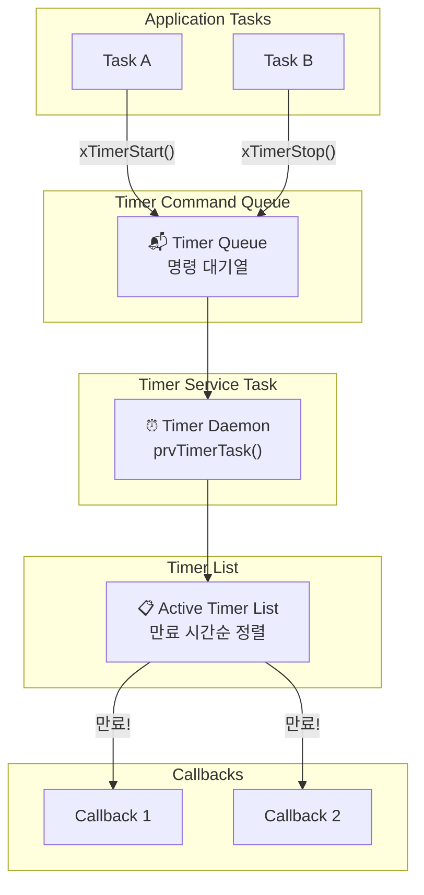
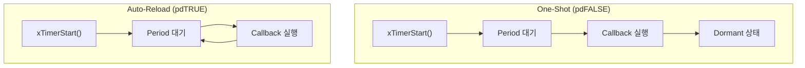
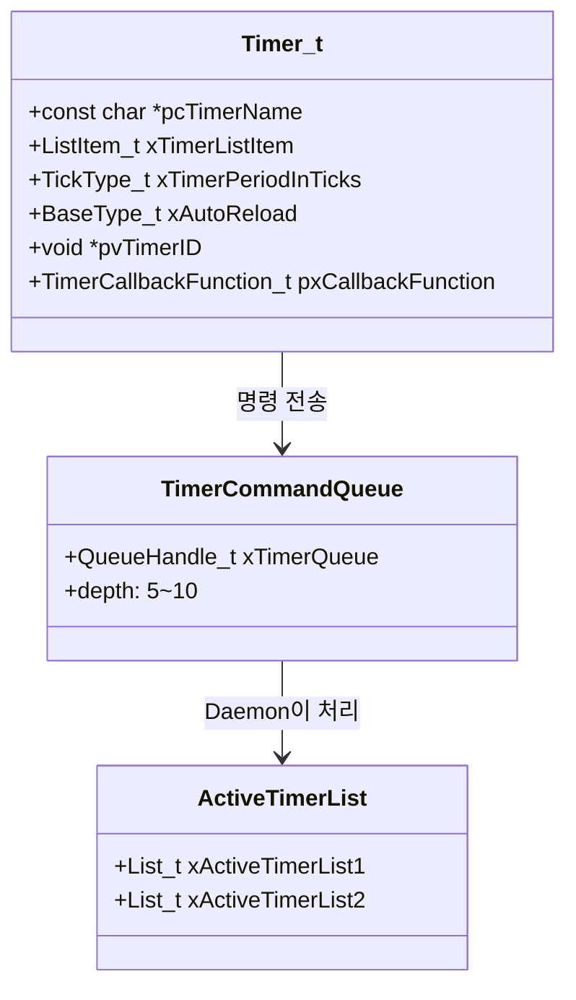
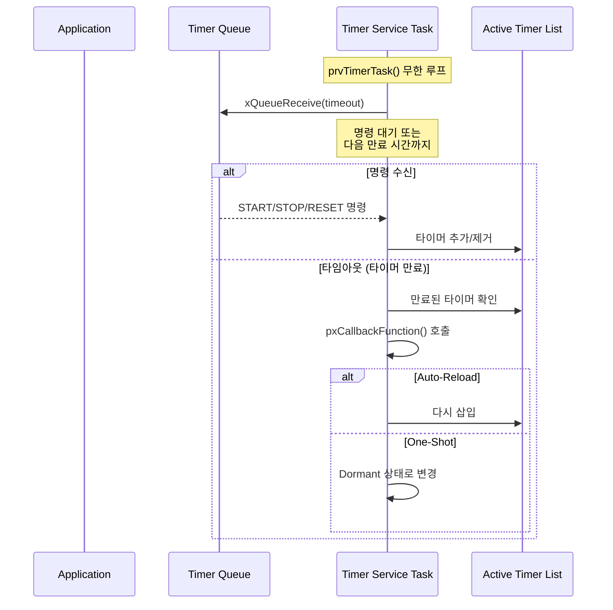
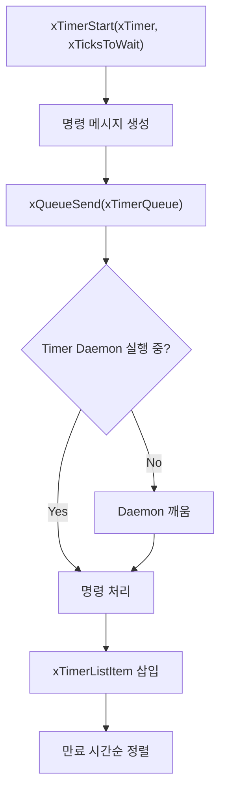
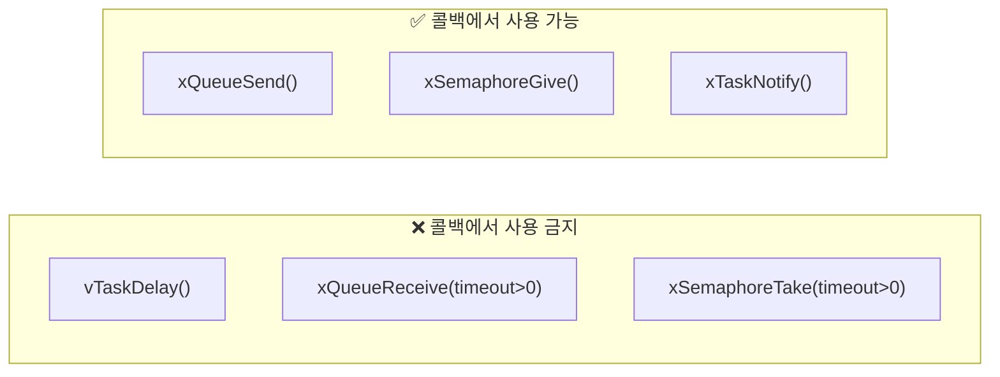

# Example 08: Software Timer 데모

## 📌 학습 목표

- Software Timer의 One-Shot / Auto-Reload 모드
- Timer Service Task (Daemon) 동작 이해
- 태스크 없이 주기적 콜백 실행

---

## 🏗️ Timer 아키텍처



---

## 🔄 One-Shot vs Auto-Reload

```mermaid
gantt
    title Timer 타입 비교
    dateFormat X
    axisFormat %L
    
    section One-Shot
    대기     :os1, 0, 500
    콜백     :crit, os2, 500, 510
    정지     :os3, 510, 1000
    
    section Auto-Reload
    대기     :ar1, 0, 200
    콜백     :crit, ar2, 200, 210
    대기     :ar3, 210, 410
    콜백     :crit, ar4, 410, 420
    대기     :ar5, 420, 620
    콜백     :crit, ar6, 620, 630
```





---

## 📦 Timer 내부 구조



---

## ⚙️ 커널 동작 원리

### Timer Service Task (Daemon)



### xTimerStart() 내부



---

## 🔍 커널 코드 분석

### Timer 생성 (timers.c)

```c
TimerHandle_t xTimerCreate(const char *pcTimerName,
                           const TickType_t xTimerPeriodInTicks,
                           const BaseType_t xAutoReload,
                           void *pvTimerID,
                           TimerCallbackFunction_t pxCallbackFunction)
{
    Timer_t *pxNewTimer;
    
    pxNewTimer = pvPortMalloc(sizeof(Timer_t));
    
    if(pxNewTimer != NULL)
    {
        pxNewTimer->pcTimerName = pcTimerName;
        pxNewTimer->xTimerPeriodInTicks = xTimerPeriodInTicks;
        pxNewTimer->xAutoReload = xAutoReload;
        pxNewTimer->pvTimerID = pvTimerID;
        pxNewTimer->pxCallbackFunction = pxCallbackFunction;
        
        vListInitialiseItem(&(pxNewTimer->xTimerListItem));
        listSET_LIST_ITEM_OWNER(&(pxNewTimer->xTimerListItem), pxNewTimer);
    }
    
    return pxNewTimer;
}
```

### Timer Daemon 루프 (timers.c)

```c
static portTASK_FUNCTION(prvTimerTask, pvParameters)
{
    TickType_t xNextExpireTime;
    BaseType_t xListWasEmpty;
    
    for(;;)
    {
        // 다음 만료 시간 계산
        xNextExpireTime = prvGetNextExpireTime(&xListWasEmpty);
        
        // 만료된 타이머 처리 또는 명령 대기
        prvProcessTimerOrBlockTask(xNextExpireTime, xListWasEmpty);
        
        // 명령 큐 처리
        prvProcessReceivedCommands();
    }
}
```

### 콜백 실행

```c
static void prvProcessExpiredTimer(TickType_t xNextExpireTime,
                                   TickType_t xTimeNow)
{
    Timer_t *pxTimer;
    
    pxTimer = listGET_OWNER_OF_HEAD_ENTRY(pxCurrentTimerList);
    uxListRemove(&(pxTimer->xTimerListItem));
    
    // 콜백 실행!
    pxTimer->pxCallbackFunction((TimerHandle_t)pxTimer);
    
    if(pxTimer->xAutoReload == pdTRUE)
    {
        // Auto-Reload: 다시 삽입
        prvReloadTimer(pxTimer, xNextExpireTime, xTimeNow);
    }
    // One-Shot: 삽입하지 않음 (Dormant)
}
```

---

## ⚠️ 콜백 제약사항



> [!CAUTION]
> 콜백은 Timer Service Task에서 실행됩니다.
> 블로킹하면 다른 타이머도 지연됩니다!

---

## 📋 API 요약

| API | 설명 |
|-----|------|
| `xTimerCreate()` | 타이머 생성 |
| `xTimerStart()` | 타이머 시작 |
| `xTimerStop()` | 타이머 정지 |
| `xTimerReset()` | 리셋 및 재시작 |
| `xTimerChangePeriod()` | 주기 변경 |
| `xTimerIsTimerActive()` | 활성 여부 확인 |
| `pvTimerGetTimerID()` | 타이머 ID 조회 |

---

## 🚀 사용 방법

```c
// One-Shot 타이머 (5초 후 한 번)
xOneShotTimer = xTimerCreate("OneShot",
                              pdMS_TO_TICKS(5000),
                              pdFALSE,  // One-Shot
                              NULL,
                              vOneShotCallback);

// Auto-Reload 타이머 (1초마다)
xAutoReloadTimer = xTimerCreate("AutoReload",
                                 pdMS_TO_TICKS(1000),
                                 pdTRUE,  // Auto-Reload
                                 NULL,
                                 vAutoReloadCallback);

// 시작
xTimerStart(xOneShotTimer, 0);
xTimerStart(xAutoReloadTimer, 0);
```

---

## 💡 핵심 정리

1. **Daemon Task**: 모든 콜백은 Timer Service Task에서 실행
2. **One-Shot**: 한 번 실행 후 Dormant
3. **Auto-Reload**: 자동 반복
4. **블로킹 금지**: 콜백에서 대기 API 사용 불가
