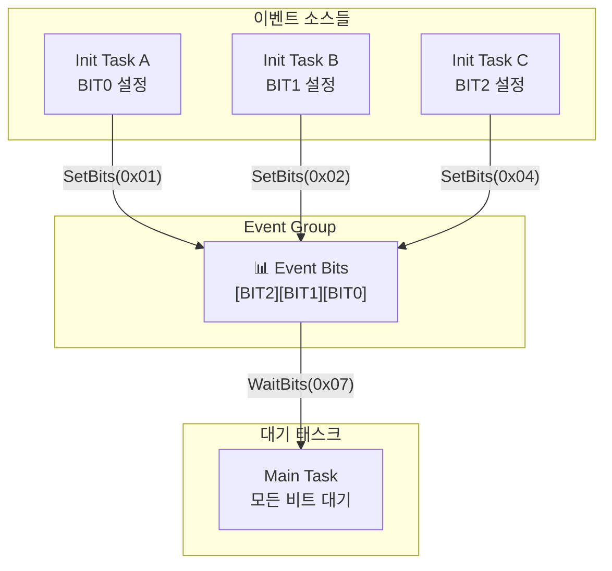
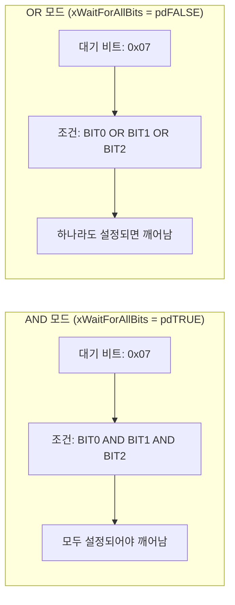
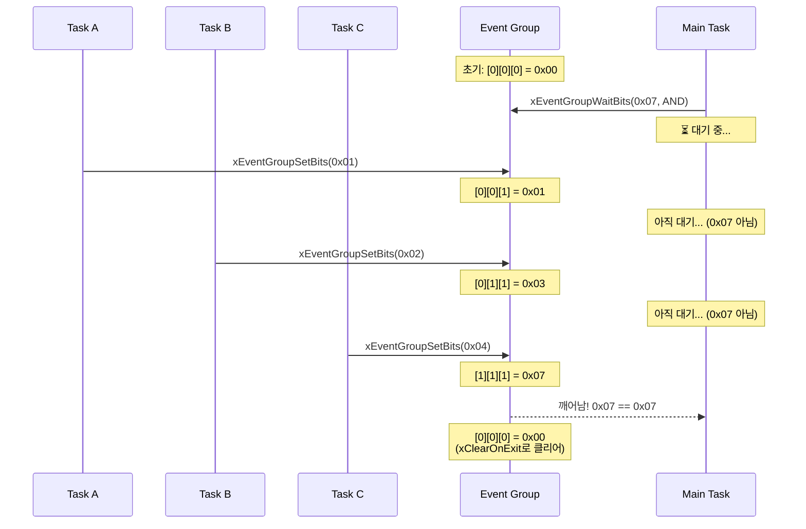
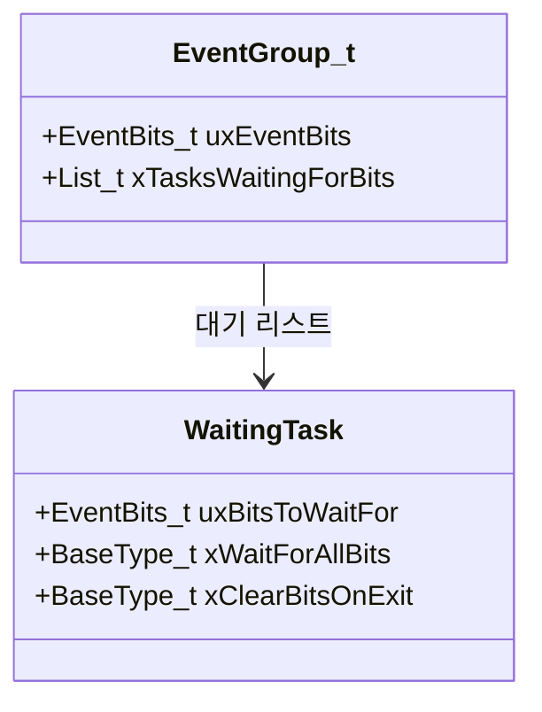
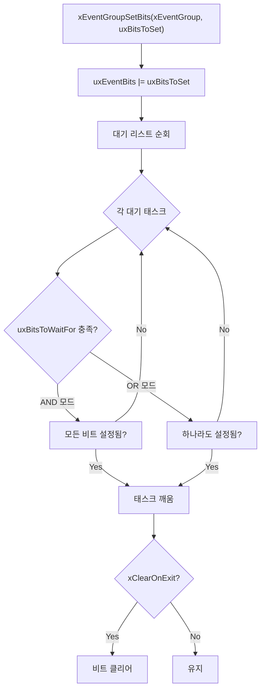
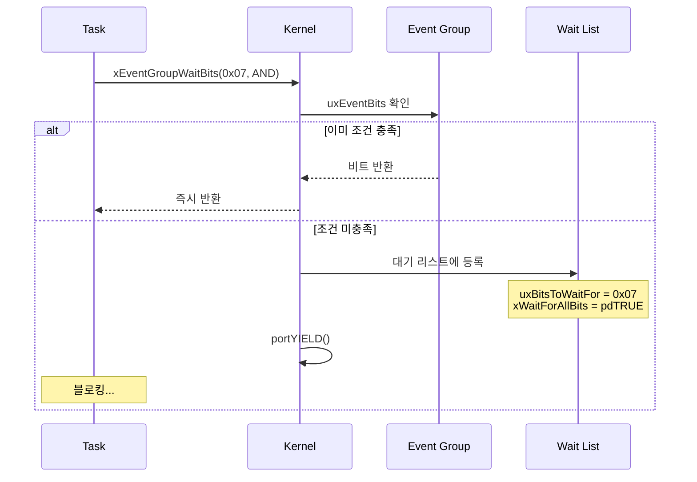
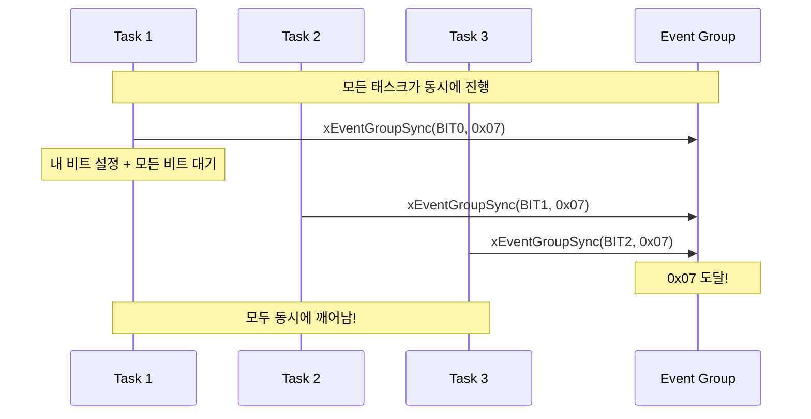

# Example 09: Event Groups 데모

## 📌 학습 목표

- Event Groups로 다중 이벤트 동기화
- AND/OR 조건 대기 이해
- Rendezvous (Barrier) 패턴 구현

---

## 🏗️ 동기화 패턴



---

## 🔄 AND vs OR 대기



---

## 📊 비트 설정 시퀀스



---

## 📦 Event Group 내부 구조



```
Event Bits 구조:
┌──────────────────────────────────────────────────┐
│ Bit23 │ ... │ Bit7 │ Bit6 │ ... │ Bit2 │ Bit1 │ Bit0 │
└──────────────────────────────────────────────────┘
        ↑ 24비트 사용 가능 (32비트 Tick 시)
        ↑ 8비트 사용 가능 (16비트 Tick 시)
```

---

## ⚙️ 커널 동작 원리

### xEventGroupSetBits() 내부



### xEventGroupWaitBits() 내부



---

## 🔍 커널 코드 분석

### Event Group 생성 (event_groups.c)

```c
EventGroupHandle_t xEventGroupCreate(void)
{
    EventGroup_t *pxEventBits;
    
    pxEventBits = pvPortMalloc(sizeof(EventGroup_t));
    
    if(pxEventBits != NULL)
    {
        pxEventBits->uxEventBits = 0;
        vListInitialise(&(pxEventBits->xTasksWaitingForBits));
    }
    
    return pxEventBits;
}
```

### SetBits 로직 (event_groups.c)

```c
EventBits_t xEventGroupSetBits(EventGroupHandle_t xEventGroup,
                               const EventBits_t uxBitsToSet)
{
    EventGroup_t *pxEventBits = xEventGroup;
    ListItem_t *pxListItem;
    EventBits_t uxBitsToClear = 0;
    
    taskENTER_CRITICAL();
    {
        pxEventBits->uxEventBits |= uxBitsToSet;
        
        // 대기 중인 태스크들 확인
        pxListItem = listGET_HEAD_ENTRY(
            &(pxEventBits->xTasksWaitingForBits));
            
        while(pxListItem != listGET_END_MARKER(...))
        {
            // 조건 충족 여부 확인 및 태스크 깨움
            uxBitsToClear |= prvCheckWaitCondition(pxListItem);
            pxListItem = listGET_NEXT(pxListItem);
        }
        
        // 클리어 요청된 비트 제거
        pxEventBits->uxEventBits &= ~uxBitsToClear;
    }
    taskEXIT_CRITICAL();
    
    return pxEventBits->uxEventBits;
}
```

---

## 🔄 Rendezvous (Barrier) 패턴



```c
// Rendezvous 구현
EventBits_t uxReturn = xEventGroupSync(
    xEventGroup,
    MY_TASK_BIT,      // 내가 설정할 비트
    ALL_TASK_BITS,    // 모두 설정되길 기다릴 비트
    portMAX_DELAY
);
```

---

## 📋 API 요약

| API | 설명 |
|-----|------|
| `xEventGroupCreate()` | Event Group 생성 |
| `xEventGroupSetBits()` | 비트 설정 |
| `xEventGroupClearBits()` | 비트 클리어 |
| `xEventGroupWaitBits()` | 비트 대기 (AND/OR) |
| `xEventGroupSync()` | Rendezvous 동기화 |
| `xEventGroupGetBits()` | 현재 비트 조회 |

---

## 🚀 사용 방법

```c
// Event Group 생성
EventGroupHandle_t xEventGroup = xEventGroupCreate();

// 비트 설정
xEventGroupSetBits(xEventGroup, BIT_SENSOR_READY);

// 모든 비트 대기 (AND)
EventBits_t uxBits = xEventGroupWaitBits(
    xEventGroup,
    BIT_SENSOR_READY | BIT_MOTOR_READY | BIT_COMM_READY,
    pdTRUE,          // 완료 후 클리어
    pdTRUE,          // AND 모드
    portMAX_DELAY
);
```

---

## 💡 핵심 정리

1. **다중 이벤트**: 여러 조건을 하나로 동기화
2. **AND/OR**: 모두 또는 하나라도 조건
3. **Rendezvous**: 여러 태스크가 한 지점에서 만남
4. **비트 수**: 24비트 (32비트 Tick) 또는 8비트
