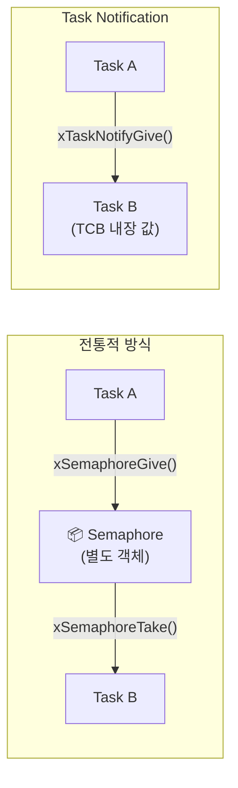
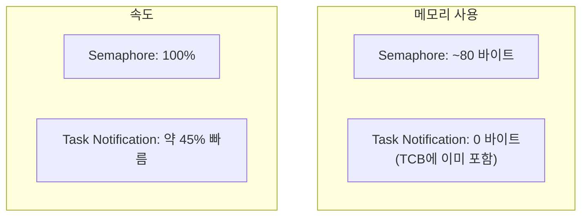
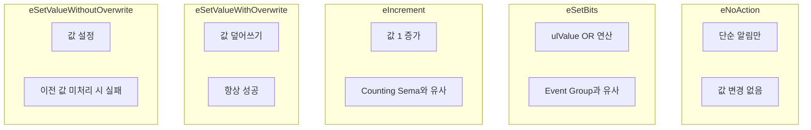
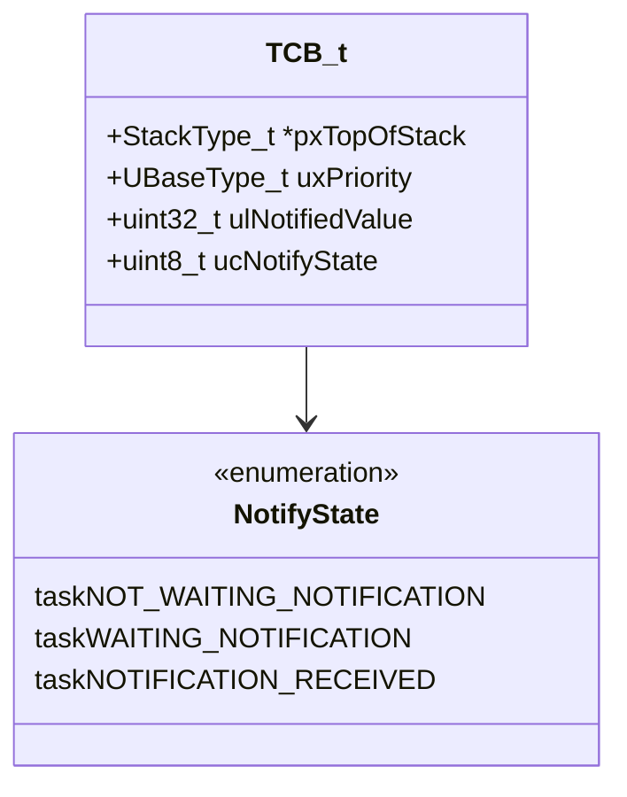
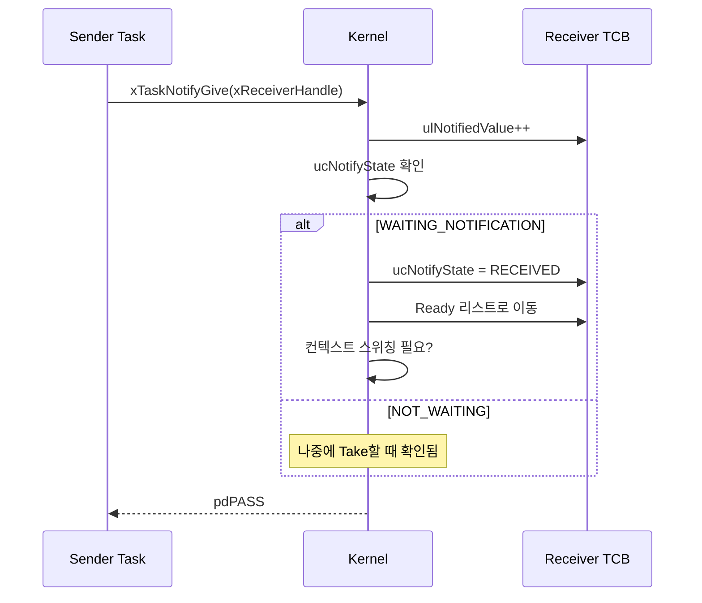
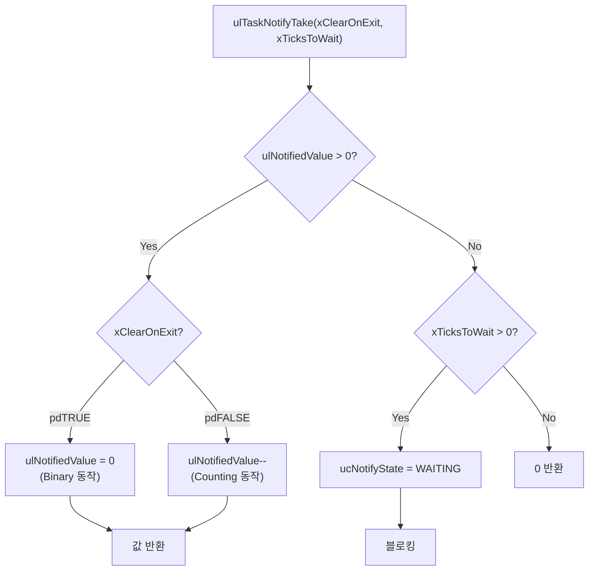
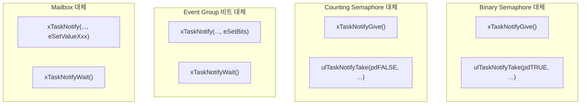
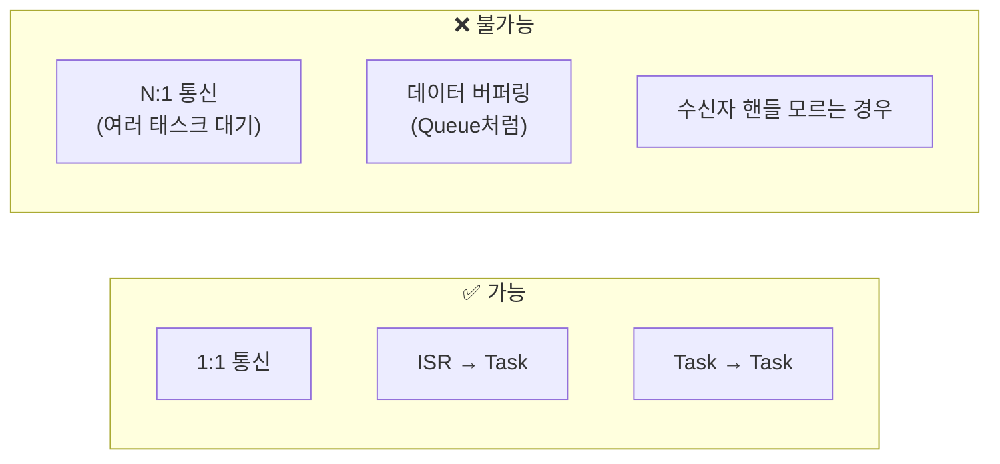

# Example 10: Task Notification 데모

## 📌 학습 목표

- Task Notification으로 경량 IPC 구현
- Semaphore/Queue 대비 장단점 이해
- 다양한 Notification 모드 활용

---

## 🆚 전통적 IPC vs Task Notification



---

## 📊 성능 비교



| 항목 | Binary Semaphore | Task Notification |
|------|------------------|-------------------|
| 추가 메모리 | ~80 bytes | 0 bytes |
| 생성 필요 | Yes | No |
| 속도 | 기준 | ~45% 빠름 |
| N:1 통신 | 가능 | 불가능 |
| ISR 지원 | 가능 | 가능 |

---

## 🔄 Notification 동작 모드



---

## 📦 TCB 내 Notification 구조



---

## ⚙️ 커널 동작 원리

### xTaskNotifyGive() 내부



### ulTaskNotifyTake() 내부



---

## 🔍 커널 코드 분석

### xTaskGenericNotify() (tasks.c)

```c
BaseType_t xTaskGenericNotify(TaskHandle_t xTaskToNotify,
                               uint32_t ulValue,
                               eNotifyAction eAction,
                               uint32_t *pulPreviousNotificationValue)
{
    TCB_t *pxTCB = xTaskToNotify;
    
    taskENTER_CRITICAL();
    {
        if(pulPreviousNotificationValue != NULL)
        {
            *pulPreviousNotificationValue = pxTCB->ulNotifiedValue;
        }
        
        // Action에 따른 값 변경
        switch(eAction)
        {
            case eSetBits:
                pxTCB->ulNotifiedValue |= ulValue;
                break;
                
            case eIncrement:
                pxTCB->ulNotifiedValue++;
                break;
                
            case eSetValueWithOverwrite:
                pxTCB->ulNotifiedValue = ulValue;
                break;
                
            case eSetValueWithoutOverwrite:
                if(pxTCB->ucNotifyState != taskNOTIFICATION_RECEIVED)
                {
                    pxTCB->ulNotifiedValue = ulValue;
                }
                else
                {
                    xReturn = pdFAIL;
                }
                break;
                
            case eNoAction:
                break;
        }
        
        // 대기 중이면 깨움
        if(pxTCB->ucNotifyState == taskWAITING_NOTIFICATION)
        {
            pxTCB->ucNotifyState = taskNOTIFICATION_RECEIVED;
            prvAddTaskToReadyList(pxTCB);
            
            if(pxTCB->uxPriority > pxCurrentTCB->uxPriority)
            {
                taskYIELD_IF_USING_PREEMPTION();
            }
        }
    }
    taskEXIT_CRITICAL();
    
    return xReturn;
}
```

---

## 📋 전통적 IPC 대체 패턴



---

## ⚠️ 제약 사항



---

## 🚀 사용 방법

```c
// Binary Semaphore처럼 사용
void vSenderTask(void)
{
    xTaskNotifyGive(xReceiverHandle);
}

void vReceiverTask(void)
{
    ulTaskNotifyTake(pdTRUE, portMAX_DELAY);  // Binary
    // 또는
    ulTaskNotifyTake(pdFALSE, portMAX_DELAY); // Counting
}

// 값 전달
xTaskNotify(xHandle, 0x1234, eSetValueWithOverwrite);
xTaskNotifyWait(0, ULONG_MAX, &ulReceivedValue, portMAX_DELAY);
```

---

## 💡 핵심 정리

1. **경량**: 별도 객체 생성 불필요
2. **빠름**: ~45% 성능 향상
3. **1:1 전용**: 다중 대기 불가
4. **다양한 모드**: 비트/증가/값 설정
