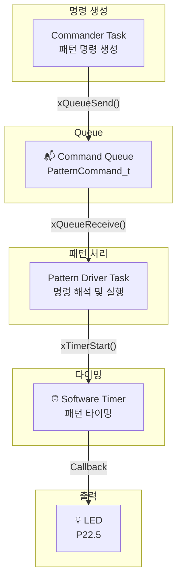
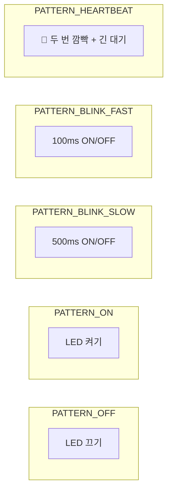
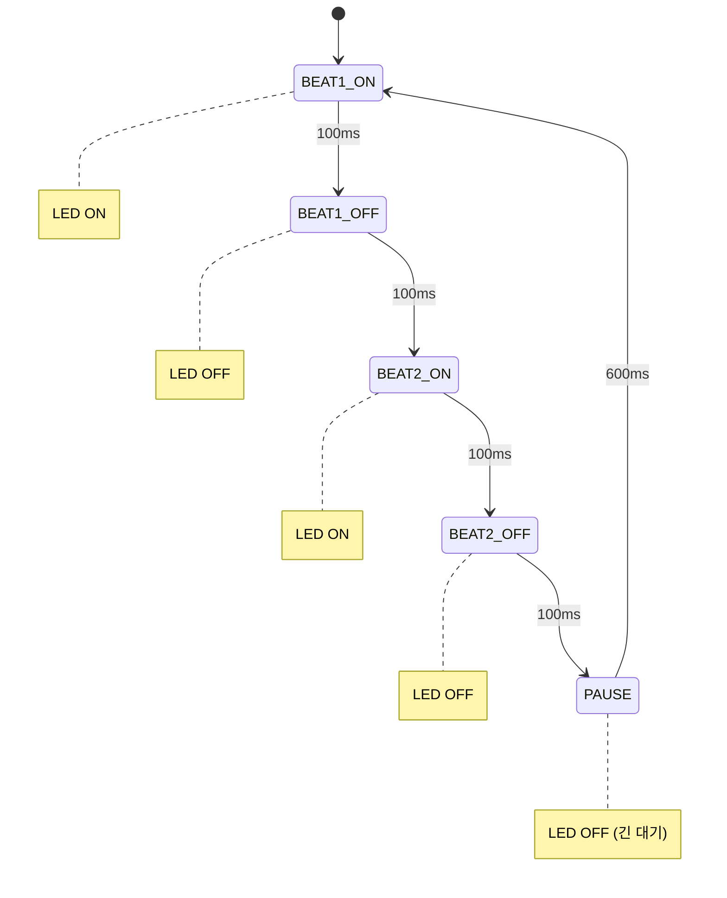
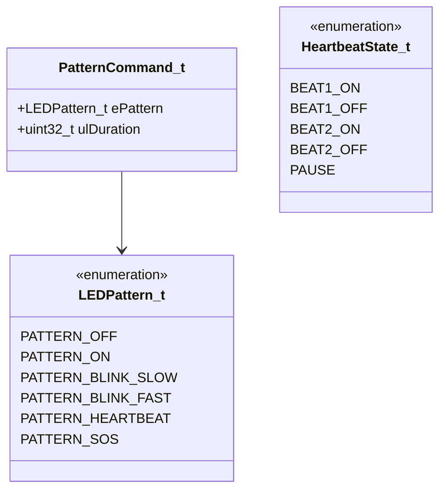
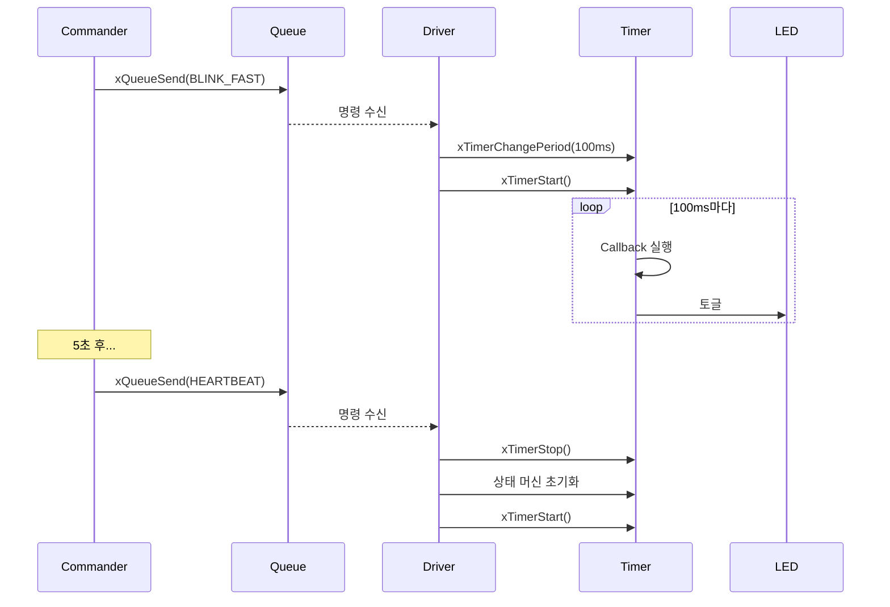
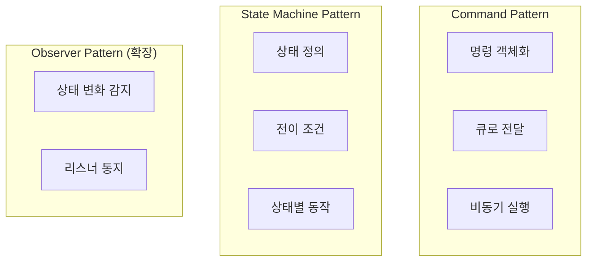
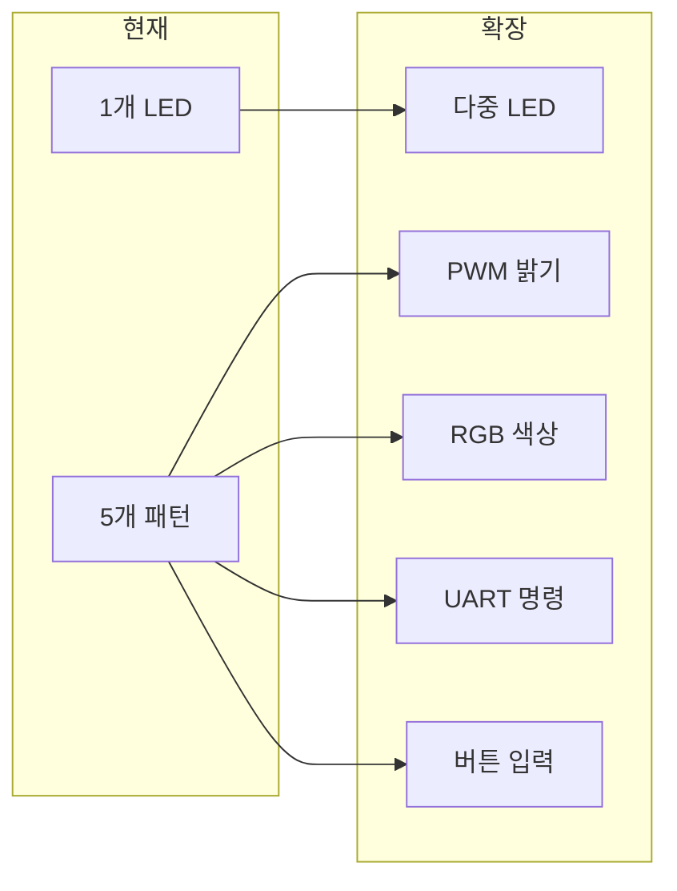

# Example 11: LED 패턴 컨트롤러 데모

## 📌 학습 목표

- Queue + Timer + State Machine 조합
- 명령-처리자 아키텍처 패턴
- 실제 임베디드 시스템 설계 적용

---

## 🏗️ 시스템 아키텍처



---

## 🔄 패턴 종류



---

## ❤️ Heartbeat 상태 머신



---

## 📊 타이밍 다이어그램

```mermaid
gantt
    title Heartbeat 패턴 (1초 주기)
    dateFormat X
    axisFormat %L
    
    section LED
    ON      :crit, a1, 0, 100
    OFF     :a2, 100, 200
    ON      :crit, a3, 200, 300
    OFF     :a4, 300, 900
    ON      :crit, a5, 900, 1000
```



---

## 📦 데이터 구조



---

## ⚙️ 동작 시퀀스



---

## 🔍 핵심 코드 분석

### 명령 전송

```c
typedef struct
{
    LEDPattern_t ePattern;
    uint32_t ulDuration;  // 0 = 무한
} PatternCommand_t;

// Commander에서 명령 전송
PatternCommand_t xCommand;
xCommand.ePattern = PATTERN_HEARTBEAT;
xCommand.ulDuration = 0;
xQueueSend(xCommandQueue, &xCommand, 0);
```

### 패턴 처리

```c
// Driver Task
for(;;)
{
    if(xQueueReceive(xCommandQueue, &xCmd, portMAX_DELAY) == pdPASS)
    {
        xTimerStop(xPatternTimer, 0);
        g_eCurrentPattern = xCmd.ePattern;
        
        switch(xCmd.ePattern)
        {
            case PATTERN_BLINK_FAST:
                xTimerChangePeriod(xPatternTimer, pdMS_TO_TICKS(100), 0);
                xTimerStart(xPatternTimer, 0);
                break;
            // ... 다른 패턴들
        }
    }
}
```

### Timer 콜백 (상태 머신)

```c
void prvPatternTimerCallback(TimerHandle_t xTimer)
{
    switch(g_eCurrentPattern)
    {
        case PATTERN_HEARTBEAT:
            switch(g_eHeartbeatState)
            {
                case HEARTBEAT_BEAT1_ON:
                    LED_ON();
                    g_eHeartbeatState = HEARTBEAT_BEAT1_OFF;
                    xTimerChangePeriod(xTimer, pdMS_TO_TICKS(100), 0);
                    break;
                // ... 상태 전이
            }
            break;
    }
}
```

---

## 🎯 설계 패턴



---

## 🚀 확장 가능성



---

## 💡 핵심 정리

1. **분리**: 명령 생성과 처리 분리 (Loose Coupling)
2. **버퍼링**: Queue로 명령 버퍼링
3. **상태 머신**: 복잡한 패턴을 상태로 관리
4. **Timer**: 정밀한 타이밍 제어
