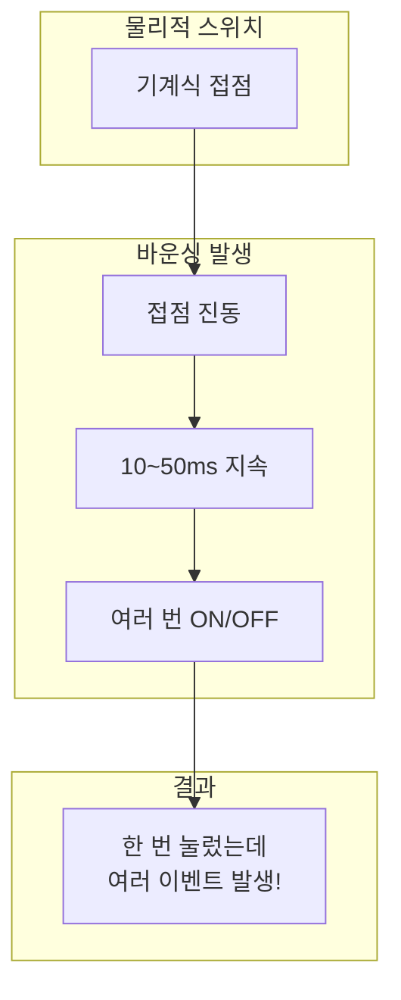
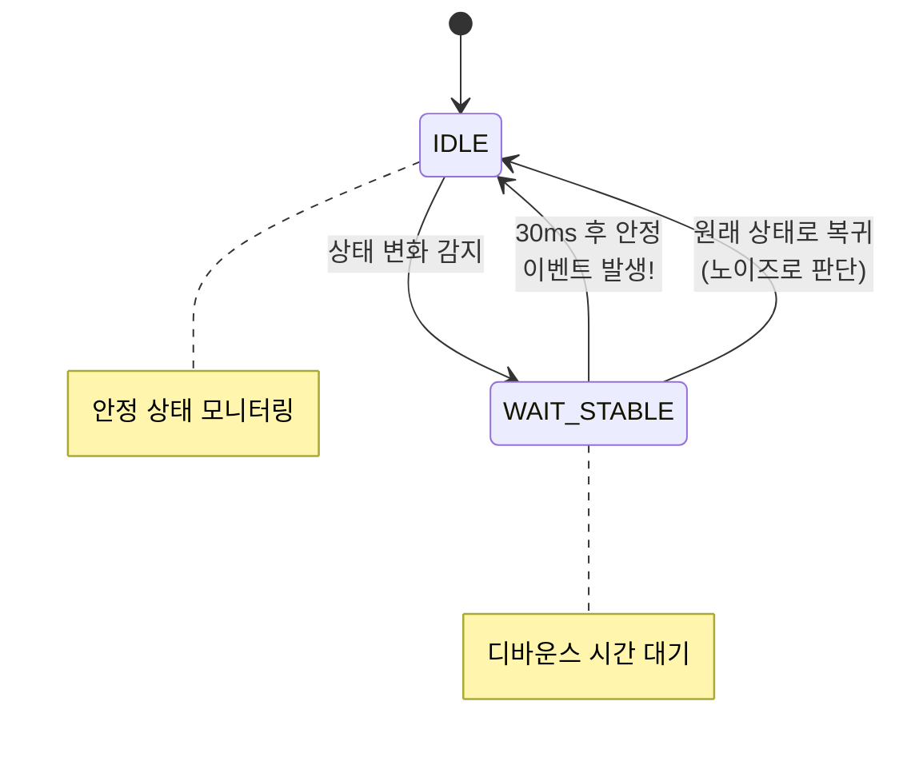
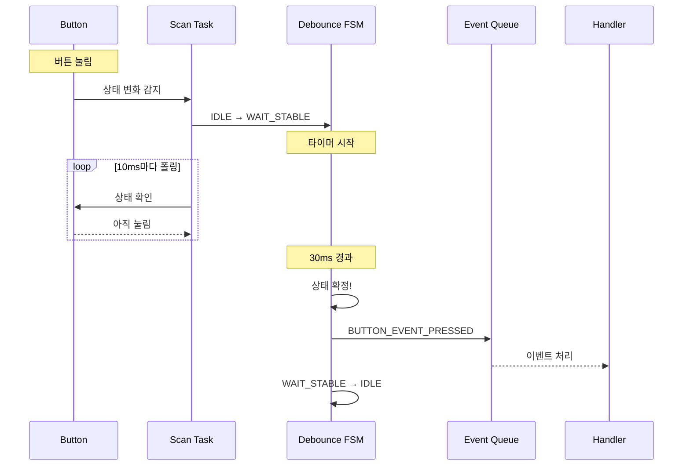
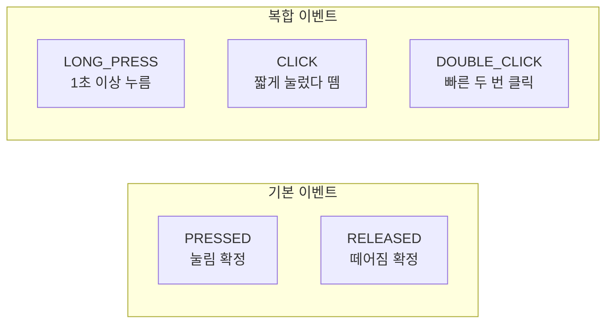
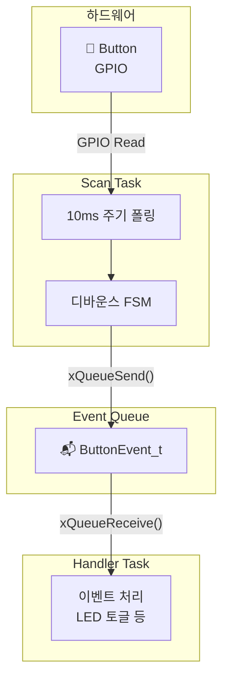
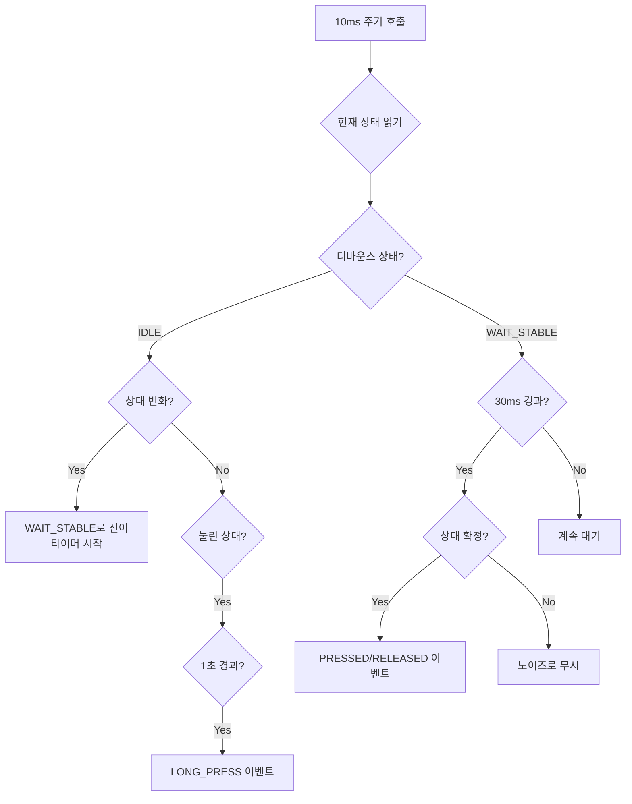
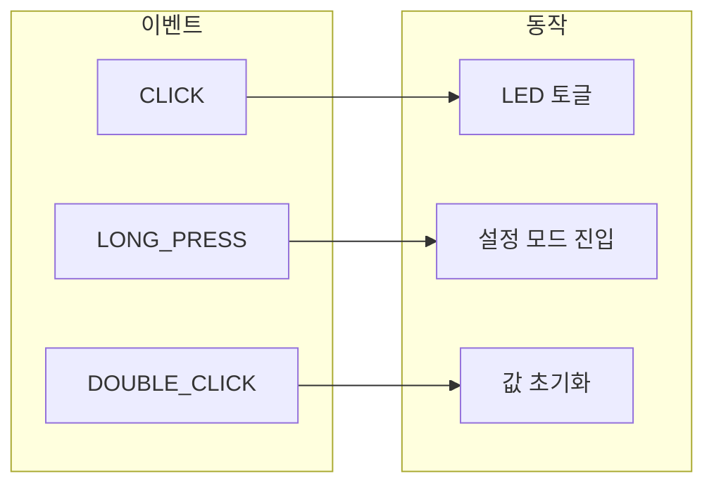

# Example 12: 버튼 디바운싱 데모

## 📌 학습 목표

- 버튼 바운싱 문제와 해결책 이해
- 상태 머신 기반 디바운스 구현
- 버튼 이벤트 (Press/Release/LongPress) 처리

---

## ⚡ 버튼 바운싱 문제



```
실제 버튼 신호:
─────┐   ┌┐┌─┐  ┌────────────────
     └───┘└┘ └──┘
     <──바운싱──>

디바운스 후:
─────┐              ┌────────────────
     └──────────────┘
          깨끗한 신호
```

---

## 🔄 디바운스 상태 머신



---

## 📊 디바운스 타이밍



---

## 📦 이벤트 종류



---

## 🏗️ 시스템 아키텍처



---

## ⚙️ 디바운스 알고리즘



---

## 🔍 핵심 코드 분석

### 버튼 상태 구조체

```c
typedef struct
{
    BaseType_t xCurrentState;       // 현재 읽은 상태
    BaseType_t xLastStableState;    // 마지막 안정 상태
    DebounceState_t eDebounceState; // 디바운스 상태
    TickType_t xLastChangeTime;     // 마지막 상태 변화 시간
    TickType_t xPressStartTime;     // 눌림 시작 시간
    BaseType_t xLongPressReported;  // 롱 프레스 이미 보고됨
} ButtonState_t;
```

### 디바운스 로직

```c
void prvProcessButtonDebounce(void)
{
    TickType_t xCurrentTime = xTaskGetTickCount();
    BaseType_t xRawState = prvReadButtonRaw();
    
    switch(g_xButtonState.eDebounceState)
    {
        case DEBOUNCE_IDLE:
            if(xRawState != g_xButtonState.xLastStableState)
            {
                // 상태 변화 감지 → 디바운스 대기 시작
                g_xButtonState.xLastChangeTime = xCurrentTime;
                g_xButtonState.eDebounceState = DEBOUNCE_WAIT_STABLE;
            }
            else if(g_xButtonState.xLastStableState == pdTRUE)
            {
                // 롱 프레스 체크
                if((xCurrentTime - g_xButtonState.xPressStartTime) >= 
                   pdMS_TO_TICKS(LONG_PRESS_TIME_MS))
                {
                    // LONG_PRESS 이벤트!
                }
            }
            break;
            
        case DEBOUNCE_WAIT_STABLE:
            if((xCurrentTime - g_xButtonState.xLastChangeTime) >= 
               pdMS_TO_TICKS(DEBOUNCE_TIME_MS))
            {
                // 디바운스 시간 경과 → 상태 확정
                if(xRawState != g_xButtonState.xLastStableState)
                {
                    g_xButtonState.xLastStableState = xRawState;
                    // PRESSED 또는 RELEASED 이벤트!
                }
                g_xButtonState.eDebounceState = DEBOUNCE_IDLE;
            }
            break;
    }
}
```

---

## 📋 설계 파라미터

| 파라미터 | 값 | 설명 |
|----------|-----|------|
| DEBOUNCE_TIME_MS | 30ms | 디바운스 대기 시간 |
| LONG_PRESS_TIME_MS | 1000ms | 롱 프레스 판정 시간 |
| SCAN_PERIOD_MS | 10ms | 버튼 폴링 주기 |

> [!TIP]
> 폴링 주기는 디바운스 시간의 1/3 이하로 설정

---

## 🎯 이벤트 처리 예시



---

## 💡 핵심 정리

1. **바운싱**: 기계식 스위치의 접점 진동
2. **디바운스**: 상태 안정까지 30ms 대기
3. **상태 머신**: IDLE ↔ WAIT_STABLE
4. **분리**: 폴링(Scan)과 처리(Handler) 분리
