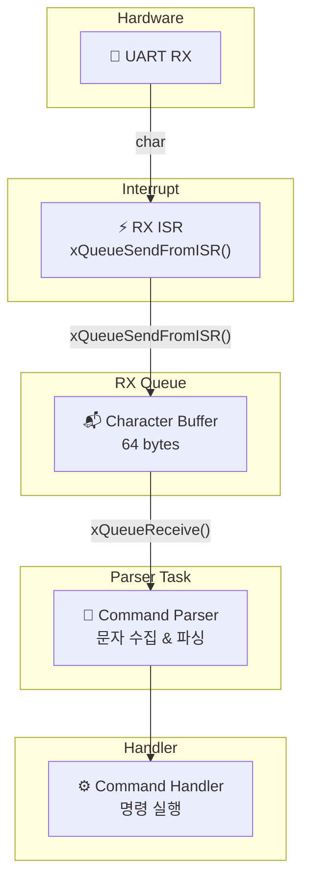
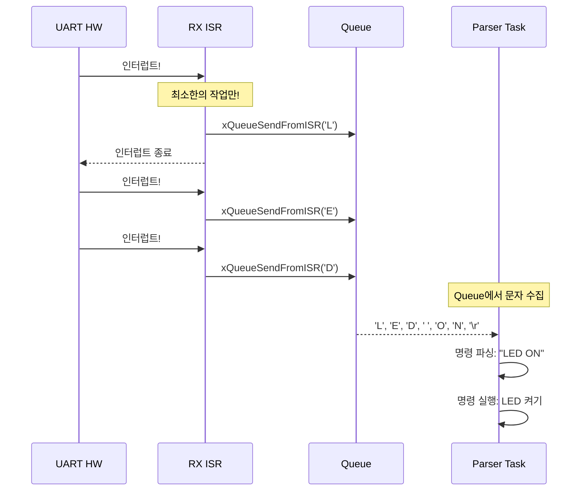
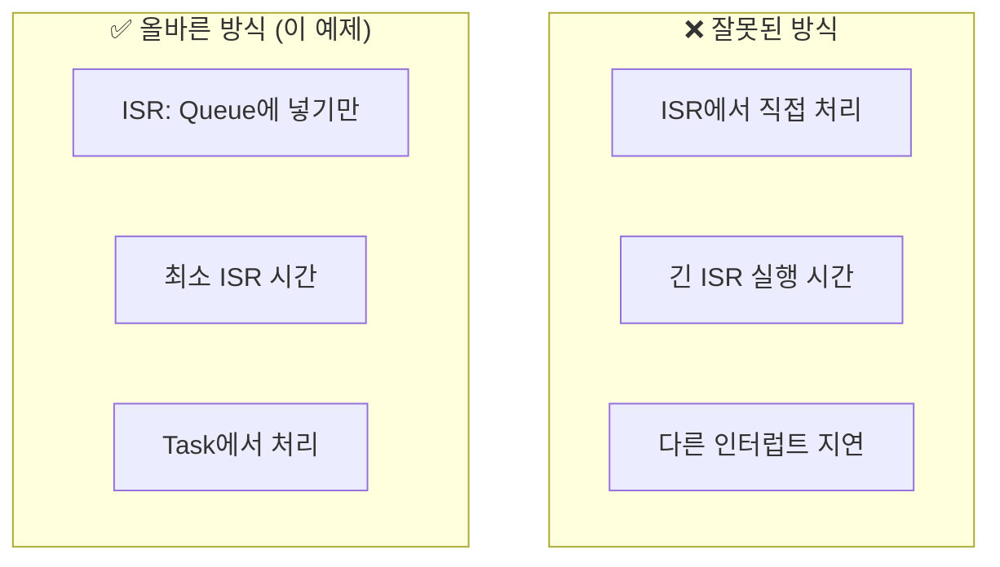
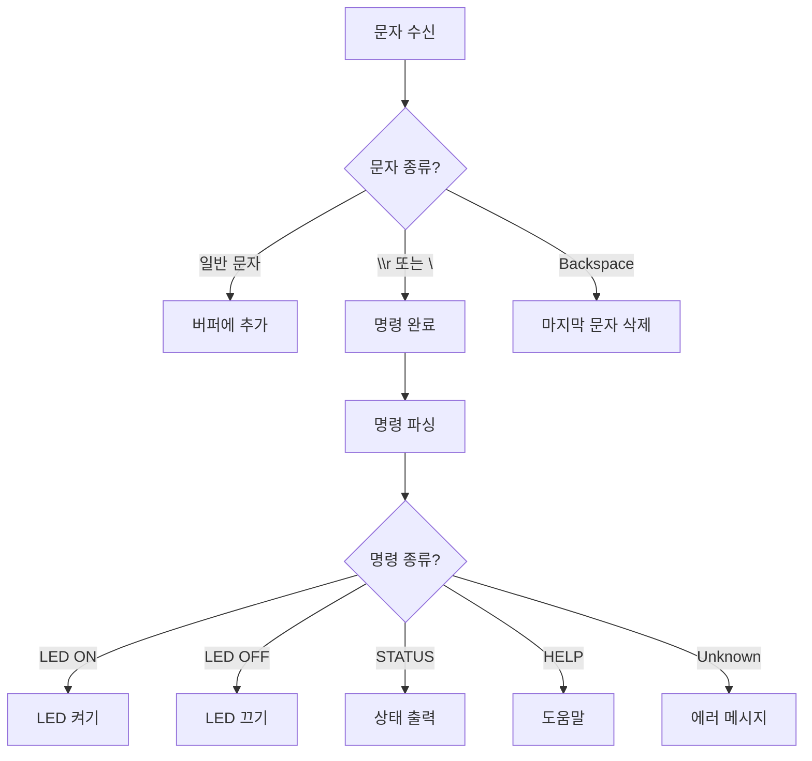
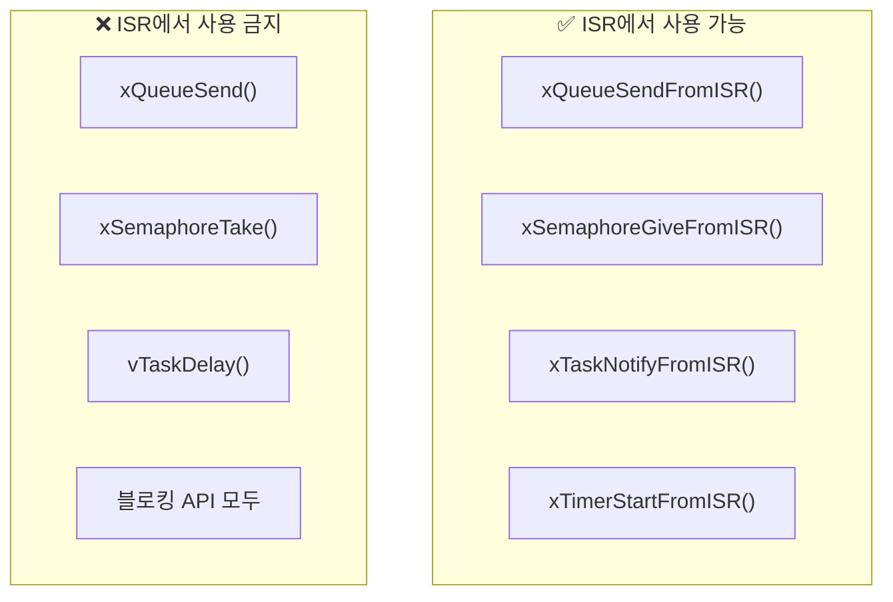
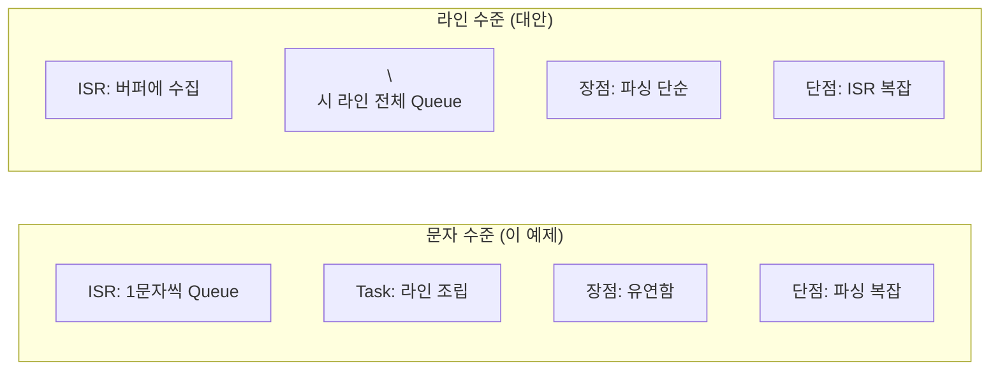
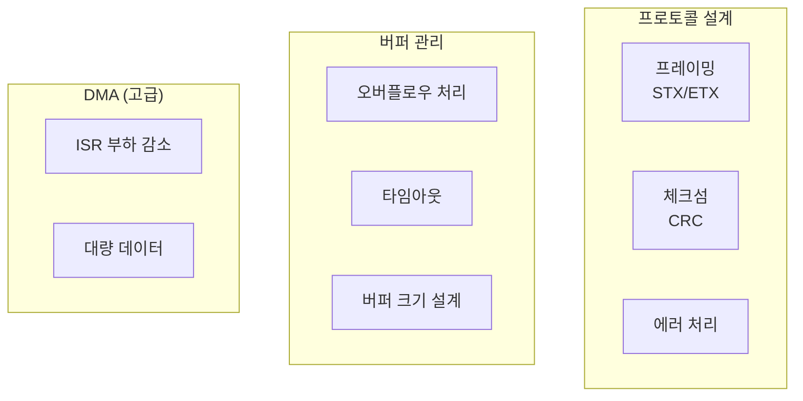

# Example 13: UART Queue 통신 데모

## 📌 학습 목표

- ISR에서 Queue로 데이터 전달
- 텍스트 명령 파서 구현
- 인터럽트 지연 처리 (Deferred Interrupt Processing)

---

## 🏗️ 시스템 아키텍처



---

## 🔄 Deferred Interrupt Processing



---

## 📊 ISR 처리 시간 비교



---

## 📦 명령 파서 구조



---

## 🔍 ISR 코드 분석

### FromISR API 사용

```c
void vUART_RxISR(uint8_t ucReceivedByte)
{
    BaseType_t xHigherPriorityTaskWoken = pdFALSE;
    char cChar = (char)ucReceivedByte;
    
    // ISR에서는 반드시 FromISR 버전!
    xQueueSendFromISR(xRxQueue, 
                      &cChar, 
                      &xHigherPriorityTaskWoken);
    
    // 더 높은 우선순위 태스크가 깨어났으면 컨텍스트 스위칭
    portYIELD_FROM_ISR(xHigherPriorityTaskWoken);
}
```

### 파서 태스크

```c
void prvCommandParserTask(void *pvParameters)
{
    char cReceivedChar;
    char acCmdBuffer[CMD_BUFFER_SIZE];
    uint32_t ulCmdIndex = 0;
    
    for(;;)
    {
        // Queue에서 문자 수신 (블로킹)
        if(xQueueReceive(xRxQueue, &cReceivedChar, portMAX_DELAY) == pdPASS)
        {
            if(cReceivedChar == '\r' || cReceivedChar == '\n')
            {
                // 명령 완료 → 파싱 및 실행
                acCmdBuffer[ulCmdIndex] = '\0';
                CommandType_t eCmd = prvParseCommand(acCmdBuffer);
                prvExecuteCommand(eCmd);
                ulCmdIndex = 0;
            }
            else
            {
                // 버퍼에 추가
                if(ulCmdIndex < CMD_BUFFER_SIZE - 1)
                {
                    acCmdBuffer[ulCmdIndex++] = cReceivedChar;
                }
            }
        }
    }
}
```

---

## ⚠️ ISR API 규칙



> [!CAUTION]
> ISR에서 블로킹 API를 호출하면 시스템이 멈춥니다!

---

## 📋 지원 명령어

| 명령 | 설명 | 응답 |
|------|------|------|
| `LED ON` | LED 켜기 | "LED is ON" |
| `LED OFF` | LED 끄기 | "LED is OFF" |
| `LED TOGGLE` | LED 토글 | "LED toggled" |
| `STATUS` | 현재 상태 | 상태 정보 |
| `HELP` | 도움말 | 명령어 목록 |

---

## 🔄 문자 vs 라인 수준 Queue



---

## 🚀 실제 적용 시 고려사항



---

## 💡 핵심 정리

1. **ISR 최소화**: Queue에 넣기만 하고 빠르게 반환
2. **FromISR**: ISR에서는 반드시 FromISR 버전 사용
3. **Deferred Processing**: 복잡한 처리는 Task에서
4. **버퍼링**: Queue로 데이터 손실 방지
