# FreeRTOS TriCore 학습 가이드

이 가이드는 Infineon TriCore 보드에서 FreeRTOS를 학습하기 위한 종합 안내서입니다.

## 목차

1. [FreeRTOS 개요](#1-freertos-개요)
2. [TriCore 포팅 레이어](#2-tricore-포팅-레이어)
3. [예제 학습 순서](#3-예제-학습-순서)
4. [핵심 개념 정리](#4-핵심-개념-정리)
5. [디버깅 팁](#5-디버깅-팁)
6. [Best Practices](#6-best-practices)

---

## 1. FreeRTOS 개요

### 1.1 RTOS란?

**RTOS (Real-Time Operating System)**는 실시간 응답이 필요한 임베디드 시스템을 위한 운영체제입니다.

```
┌─────────────────────────────────────────────────────────────┐
│                    베어메탈 vs RTOS                         │
├──────────────────────────┬──────────────────────────────────┤
│ 베어메탈 (슈퍼루프)      │ RTOS                             │
├──────────────────────────┼──────────────────────────────────┤
│ while(1) {               │ Task1: 센서 읽기 (높은 우선순위) │
│   readSensor();          │ Task2: 디스플레이 갱신           │
│   updateDisplay();       │ Task3: 통신 처리                 │
│   processCommunication();│ 스케줄러가 자동으로 관리         │
│ }                        │                                  │
├──────────────────────────┼──────────────────────────────────┤
│ 순차적 실행, 블로킹 문제 │ 병렬 실행, 우선순위 기반         │
└──────────────────────────┴──────────────────────────────────┘
```

### 1.2 FreeRTOS 특징

- **무료 오픈소스** (MIT 라이선스)
- **경량화** (최소 4~9KB RAM)
- **이식성** (다양한 아키텍처 지원)
- **선점형 스케줄링**
- **풍부한 동기화 메커니즘**

### 1.3 주요 구성 요소

| 구성 요소 | 설명 | 예제 |
|-----------|------|------|
| Task | 독립적 실행 단위 | Ex01-Ex03 |
| Queue | 태스크 간 데이터 전달 | Ex04, Ex13 |
| Semaphore | 동기화/카운팅 | Ex05, Ex06 |
| Mutex | 상호 배제 (자원 보호) | Ex07 |
| Timer | 주기적 콜백 | Ex08 |
| Event Group | 다중 이벤트 동기화 | Ex09 |
| Task Notification | 경량 IPC | Ex10 |

---

## 2. TriCore 포팅 레이어

### 2.1 프로젝트 구조

```
freeRTOSexample/
├── Cpu0_Main.c               ← 메인 함수 (태스크 생성 및 스케줄러 시작)
├── Dave/Generated/
│   └── FREERTOS_AURIX/
│       ├── FreeRTOS-Kernel/  ← FreeRTOS 커널 소스
│       │   ├── tasks.c       ← 태스크 관리
│       │   ├── queue.c       ← 큐 구현
│       │   ├── timers.c      ← 소프트웨어 타이머
│       │   └── portable/     ← TriCore 포트
│       └── freertos_aurix.c  ← AURIX 전용 설정
├── Libraries/
│   └── iLLD/                 ← Infineon Low-Level Drivers
└── Examples/                 ← 학습 예제들
```

### 2.2 FreeRTOSConfig.h 주요 설정

```c
// 스케줄러 설정
#define configUSE_PREEMPTION                1       // 선점형 사용
#define configTICK_RATE_HZ                  1000    // 1ms 틱 해상도

// 메모리 설정
#define configTOTAL_HEAP_SIZE               8192    // FreeRTOS 힙 크기
#define configMINIMAL_STACK_SIZE            256     // 태스크 최소 스택

// 기능 활성화
#define configUSE_MUTEXES                   1       // Mutex 사용
#define configUSE_COUNTING_SEMAPHORES       1       // Counting Semaphore
#define configUSE_TIMERS                    1       // Software Timer
#define configUSE_EVENT_GROUPS              1       // Event Groups
#define configUSE_TASK_NOTIFICATIONS        1       // Task Notification
```

### 2.3 시작 시퀀스

```c
void core0_main(void)
{
    // 1. 인터럽트 활성화
    IfxCpu_enableInterrupts();
    
    // 2. 워치독 비활성화
    IfxScuWdt_disableCpuWatchdog(...);
    
    // 3. CPU 동기화 (멀티코어)
    IfxCpu_emitEvent(&g_cpuSyncEvent);
    IfxCpu_waitEvent(&g_cpuSyncEvent, 1);
    
    // 4. DAVE 초기화
    DAVE_Init();
    
    // 5. 태스크 생성
    xTaskCreate(vMyTask, "TaskName", stackSize, NULL, priority, &handle);
    
    // 6. 스케줄러 시작 (반환되지 않음!)
    vTaskStartScheduler();
    
    while(1) { }  // 도달하지 않음
}
```

---

## 3. 예제 학습 순서

### 3.1 권장 학습 경로

```mermaid
graph LR
    subgraph "Week 1: 기초"
        A[Ex01: 다중 태스크] --> B[Ex02: 태스크 상태]
        B --> C[Ex03: 주기적 실행]
    end
    
    subgraph "Week 2: IPC"
        D[Ex04: Queue] --> E[Ex05: Binary Sema]
        E --> F[Ex06: Counting Sema]
        F --> G[Ex07: Mutex]
    end
    
    subgraph "Week 3: 고급"
        H[Ex08: Timer] --> I[Ex09: Event Groups]
        I --> J[Ex10: Notification]
    end
    
    subgraph "Week 4: 실전"
        K[Ex11: LED 패턴] --> L[Ex12: 버튼]
        L --> M[Ex13: UART]
    end
    
    C --> D
    G --> H
    J --> K
```



### 3.2 각 예제 핵심 학습 포인트

| 예제 | 핵심 학습 | 주요 API |
|------|-----------|----------|
| Ex01 | 우선순위, 선점 | `xTaskCreate`, `vTaskDelay` |
| Ex02 | 상태 전이 | `vTaskSuspend`, `vTaskResume` |
| Ex03 | 정밀 주기 | `vTaskDelayUntil` |
| Ex04 | 데이터 전달 | `xQueueSend`, `xQueueReceive` |
| Ex05 | 이벤트 동기화 | `xSemaphoreCreateBinary` |
| Ex06 | 리소스 풀 | `xSemaphoreCreateCounting` |
| Ex07 | 자원 보호 | `xSemaphoreCreateMutex` |
| Ex08 | 주기 콜백 | `xTimerCreate`, `xTimerStart` |
| Ex09 | 다중 동기화 | `xEventGroupWaitBits` |
| Ex10 | 경량 IPC | `xTaskNotifyGive` |
| Ex11 | 통합 응용 | Queue + Timer |
| Ex12 | HW 인터페이스 | 디바운스 패턴 |
| Ex13 | 통신 처리 | ISR + Queue |

---

## 4. 핵심 개념 정리

### 4.1 태스크 상태 다이어그램

```
                   vTaskCreate()
                        │
                        ▼
                   ┌─────────┐
        ┌─────────│  Ready  │◄──────────────┐
        │         └────┬────┘               │
        │              │                    │
   vTaskSuspend()      │ Scheduler          │ Event/Timeout
        │              │                    │
        ▼              ▼                    │
   ┌──────────┐   ┌─────────┐          ┌─────────┐
   │ Suspended│   │ Running │──────────│ Blocked │
   └──────────┘   └─────────┘ Delay/   └─────────┘
        │              │      Wait
        │              │
   vTaskResume()  vTaskDelete()
        │              │
        ▼              ▼
      Ready        ┌─────────┐
                   │ Deleted │
                   └─────────┘
```

### 4.2 동기화 메커니즘 비교

```
┌─────────────────┬────────────────┬──────────────────────────────┐
│ 메커니즘        │ 용도           │ 특징                         │
├─────────────────┼────────────────┼──────────────────────────────┤
│ Queue           │ 데이터 전달    │ FIFO, 값 복사, N:N 통신      │
│ Binary Sema     │ 이벤트 시그널  │ 0/1, ISR→Task              │
│ Counting Sema   │ 리소스 풀      │ 0~N, 카운팅                  │
│ Mutex           │ 자원 보호      │ 소유권, Priority Inheritance │
│ Event Group     │ 다중 이벤트    │ AND/OR 조건, N:1 대기        │
│ Task Notification│ 경량 IPC      │ 빠름, RAM 절약, 1:1          │
└─────────────────┴────────────────┴──────────────────────────────┘
```

### 4.3 ISR에서 사용 가능한 API

> [!IMPORTANT]
> ISR에서는 반드시 `FromISR` 접미사가 붙은 API만 사용하세요!

```c
// ✅ ISR에서 사용 가능
xQueueSendFromISR()
xQueueReceiveFromISR()
xSemaphoreGiveFromISR()
xSemaphoreTakeFromISR()  // 주의: 타임아웃 0만!
xTaskNotifyFromISR()
xTimerStartFromISR()

// ❌ ISR에서 사용 금지 (블로킹 API)
xQueueSend()       // 타임아웃 가능
xSemaphoreTake()   // 블로킹 가능
vTaskDelay()       // 절대 금지!
```

---

## 5. 디버깅 팁

### 5.1 스택 오버플로우 검출

```c
// FreeRTOSConfig.h에서 활성화
#define configCHECK_FOR_STACK_OVERFLOW  2

// 콜백 함수 구현
void vApplicationStackOverflowHook(TaskHandle_t xTask, char *pcTaskName)
{
    // LED 패턴으로 표시 또는 로그 출력
    while(1) { }  // 무한 루프로 정지
}
```

### 5.2 힙 사용량 확인

```c
size_t xFreeHeapSize = xPortGetFreeHeapSize();
size_t xMinEverFreeHeapSize = xPortGetMinimumEverFreeHeapSize();
```

### 5.3 태스크 통계 조회

```c
// 스택 사용량 (High Water Mark)
UBaseType_t uxHighWaterMark = uxTaskGetStackHighWaterMark(NULL);

// 실행 시간 통계 (configGENERATE_RUN_TIME_STATS 필요)
char pcWriteBuffer[512];
vTaskGetRunTimeStats(pcWriteBuffer);
```

---

## 6. Best Practices

### 6.1 태스크 설계

1. **단일 책임 원칙**: 하나의 태스크는 하나의 역할만
2. **적절한 우선순위**: 응답 시간 요구사항 기반 설정
3. **블로킹 사용**: CPU 낭비 방지를 위해 블로킹 API 활용
4. **스택 크기**: 최소화하되 오버플로우 방지

### 6.2 동기화 선택 기준

```
데이터 전달이 필요? ───Yes──> Queue
        │
       No
        │
단순 이벤트 시그널? ───Yes──> Binary Semaphore / Task Notification
        │
       No
        │
리소스 개수 제한? ───Yes──> Counting Semaphore
        │
       No
        │
공유 자원 보호? ───Yes──> Mutex
        │
       No
        │
다중 조건 대기? ───Yes──> Event Group
```

### 6.3 흔한 실수들

| 실수 | 결과 | 해결책 |
|------|------|--------|
| ISR에서 블로킹 API | 시스템 행 | FromISR 버전 사용 |
| Mutex 미해제 | 데드락 | try-finally 패턴 |
| 스택 크기 부족 | 오버플로우 | 충분한 크기 할당 |
| 우선순위 역전 | 응답 지연 | Mutex 사용 |
| 무한 루프 내 yield 없음 | 저우선순위 기아 | vTaskDelay 추가 |

---

## 부록: 예제 사용 방법

### A. 예제 통합 방법

```c
// Cpu0_Main.c에서
#include "Examples/Ex01_MultiTask_Priority/Ex01_MultiTask.c"

void core0_main(void)
{
    // ... 초기화 ...
    
    Ex01_RunDemo();  // 예제 시작
    
    vTaskStartScheduler();
    while(1) { }
}
```

### B. 빌드 및 실행

1. DAVE IDE에서 프로젝트 열기
2. 원하는 예제 코드 통합
3. Build Project (Ctrl+B)
4. Debug 또는 Run

### C. 파일 목록

```
Examples/
├── Ex01_MultiTask_Priority/
│   └── Ex01_MultiTask.c
├── Ex02_Task_States/
│   └── Ex02_Task_States.c
├── Ex03_Periodic_Task/
│   └── Ex03_Periodic_Task.c
├── Ex04_Queue/
│   └── Ex04_Queue.c
├── Ex05_Binary_Semaphore/
│   └── Ex05_Binary_Semaphore.c
├── Ex06_Counting_Semaphore/
│   └── Ex06_Counting_Semaphore.c
├── Ex07_Mutex/
│   └── Ex07_Mutex.c
├── Ex08_Software_Timer/
│   └── Ex08_Software_Timer.c
├── Ex09_Event_Groups/
│   └── Ex09_Event_Groups.c
├── Ex10_Task_Notification/
│   └── Ex10_Task_Notification.c
├── Ex11_LED_Pattern/
│   └── Ex11_LED_Pattern.c
├── Ex12_Button_Debounce/
│   └── Ex12_Button_Debounce.c
└── Ex13_UART_Queue/
    └── Ex13_UART_Queue.c
```

---

**문서 버전**: 1.0  
**최종 수정**: 2025-12-15
